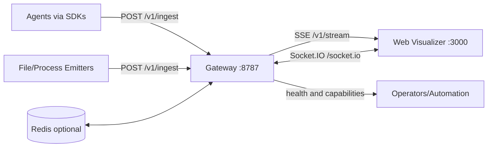

# Agent Arcade

A production-ready telemetry gateway and visualizer for multi-agent workflows.

Agent Arcade turns raw agent events into a real-time operational view: who is active, what tools are being used, where work is blocked, and how sessions progress over time.

## Why Agent Arcade

Most agent systems expose logs. Agent Arcade exposes behavior.

- Live, session-scoped visualization of agent activity
- Multi-transport ingestion: HTTP, WebSocket, SSE
- Replay support for timeline reconstruction
- Security controls for auth, signing, CORS, and rate limits
- SDKs for Node.js, browser, and Python
- Deployable with Docker Compose or PM2

## What You Get

- Gateway service (`packages/gateway`) on port `8787`
- Next.js visualizer (`packages/web`) on port `3000`
- SDKs:
  - `packages/sdk-node`
  - `packages/sdk-browser`
  - `packages/sdk-python`
- Load and simulation scripts in `scripts/load`
- Deployment assets (`docker-compose.yml`, Dockerfiles, nginx/caddy examples)

## Architecture



## Feature Highlights

### Real-time state model

Track agents through states like:

- `idle`
- `thinking`
- `reading`
- `writing`
- `tool`
- `waiting`
- `done`

### Session telemetry

- Per-session stream and replay
- Agent-level progress and labels
- Message and tool events
- Parent-child links between agents
- Position events for layout and scene rendering

### Operational safeguards

- JWT-based auth in secure mode
- Session signatures for trusted client session access
- CORS allowlist controls
- Flood and payload-size controls
- Health and readiness endpoints

## Quick Start (Local)

### Requirements

- Node.js 20+
- npm 10+
- Bun 1.3+

### 1) Install dependencies

```powershell
# from repo root
npm ci
cd packages/gateway; bun install
cd ../web; npm ci
cd ../..
```

### 2) Run gateway and web

```powershell
# terminal 1
npm run dev:gateway

# terminal 2
npm run dev:web
```

### 3) Open app

- Web: `http://localhost:3000`
- Gateway health: `http://localhost:8787/health`
- Gateway capabilities: `http://localhost:8787/v1/capabilities`

### 4) Generate realistic activity

```powershell
node scripts/load/human-like-sim.mjs
```

## Protocol Snapshot

Example ingest payload:

```json
{
  "sessionId": "copilot-live",
  "agentId": "copilot-main",
  "type": "agent.state",
  "ts": 1773120000000,
  "payload": {
    "state": "writing",
    "label": "Drafting response",
    "progress": 0.62,
    "source": "process",
    "confidence": 0.96
  }
}
```

Supported event families include:

- `agent.spawn`
- `agent.state`
- `agent.tool`
- `agent.message`
- `agent.link`
- `agent.position`
- `agent.end`
- `session.start`
- `session.end`

## API Endpoints

Gateway (`:8787`):

- `POST /v1/ingest`
- `GET /v1/stream?sessionId=...`
- `GET /v1/connect?sessionId=...`
- `GET /v1/capabilities`
- `GET /health`
- `GET /ready`

Web (`:3000`):

- `GET /api/health`
- `POST /api/session-token`

## Quality Gates

Run full local checks:

```powershell
npm run ci
```

This includes linting, typecheck, build, and automated tests for gateway/web/SDK packages.

## Production Deployment

### Docker Compose

```powershell
docker compose up -d --build
```

Set real secrets before exposing publicly:

- `JWT_SECRET`
- `SESSION_SIGNING_SECRET`
- `GATEWAY_JWT_SECRET`

Important:

- `GATEWAY_JWT_SECRET` in web must match gateway JWT secret.
- Keep session signing secret consistent between issuer and validator.

### PM2 (VM/Bare metal)

```powershell
npm run build:web
npm run prod:start
npm run prod:status
```

## Security Posture

Recommended for production:

- Enable auth (`REQUIRE_AUTH=1`)
- Use strong random secrets (32+ bytes)
- Restrict `ALLOWED_ORIGINS`
- Enable HTTPS at edge proxy (nginx/caddy)
- Keep branch protection enabled on `main`
- Require pull requests and approvals for changes

See:

- `SECURITY.md`
- `docs/DEPLOYMENT_RUNBOOK.md`
- `docs/PROD_READINESS_GAPS.md`

## Monorepo Map

- `packages/gateway`: Bun HTTP + Socket.IO + SSE telemetry gateway
- `packages/web`: Next.js visualizer and UI runtime
- `packages/sdk-node`: Node client SDK
- `packages/sdk-browser`: Browser client SDK
- `packages/sdk-python`: Python package scaffold
- `scripts/load`: load generation and simulation tools
- `docs`: runbooks, readiness notes, and integration guides

## Contributing

Contributions are welcome.

1. Fork repository
2. Create feature branch
3. Run `npm run ci`
4. Open pull request with clear scope and test evidence

See `CONTRIBUTING.md` for full guidance.

## License

MIT License. See `LICENSE`.

## Maintainer Note

This repository is designed for operator trust:

- clear event contracts
- observable runtime behavior
- explicit security controls
- deployment paths that work from local to production
