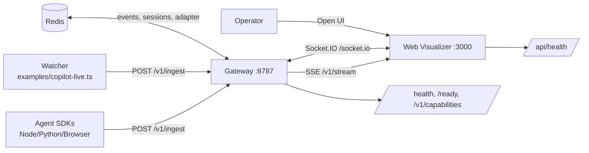

# Agent Arcade

Turn AI telemetry into a live pixel world.

<div align="center">

```text
╔══════════════════════════════════════════════════════════════════╗
║                       AGENT ARCADE                              ║
║              Real-time AI Telemetry Visualization               ║
╚══════════════════════════════════════════════════════════════════╝
```

| Release Status | Value |
|---|---|
| Quality Gate | `npm run ci` |
| Gateway Health | `GET /health` |
| Web Health | `GET /api/health` |
| Deploy Modes | `Docker Compose` / `PM2` |

</div>


Agent Arcade is a monorepo with:
- a hardened telemetry gateway (`packages/gateway`, Bun, port `8787`)
- a Next.js visualizer (`packages/web`, Node, port `3000`)
- SDKs for Node, Python, Browser
- load-test and simulation scripts

## Table of Contents

- [Why It Feels Different](#why-it-feels-different)
- [Architecture at a Glance](#architecture-at-a-glance)
- [Theme Cards](#theme-cards)
- [Deployment Speedrun (XP Route)](#deployment-speedrun-xp-route)
- [Production Deploy (Docker Compose)](#production-deploy-docker-compose)
- [Production Deploy (PM2)](#production-deploy-pm2)
- [Telemetry Protocol (v1)](#telemetry-protocol-v1)
- [API Surface](#api-surface)
- [Security Defaults](#security-defaults)
- [Quick SDK Smoke Tests](#quick-sdk-smoke-tests)
- [Monorepo Map](#monorepo-map)
- [Release Boss Fight Checklist](#release-boss-fight-checklist)
- [Useful Docs](#useful-docs)

## Why It Feels Different

- Real-time agent states (`thinking`, `writing`, `tool`, `waiting`, `done`)
- WebSocket + SSE + HTTP ingest support
- Session-scoped streaming and replay
- Built-in auth, session signatures, rate limits, flood protection
- Production deploy paths: Docker Compose or PM2

## Architecture at a Glance



## Theme Cards

The visual themes below are the current source-of-truth themes defined in `packages/web/src/lib/agent-arcade/themes/index.ts`.

| Theme | Style Card | Category | Dark |
|---|---|---|---|
| `🏢 Office` | Warm professional workspace | `calm` | `No` |
| `🎖️ War Room` | Tactical operations center | `tactical` | `Yes` |
| `👾 Retro Arcade` | Neon-lit pixel paradise | `retro` | `Yes` |
| `🔬 Cyber Lab` | High-tech research facility | `tech` | `Yes` |
| `🌿 Campus Ops` | Outdoor mission operations | `nature` | `No` |
| `🚀 Deep Space Lab` | Zero-gravity orbital station | `scifi` | `Yes` |
| `🏰 Dungeon Terminal` | Ancient stone command post | `dark` | `Yes` |
| `💀 Hacker Bunker` | Underground hacking den | `dark` | `Yes` |

---

## Deployment Speedrun (XP Route)

### Level 0: Preflight

Requirements:
- Bun `1.3+`
- Node.js `20+`
- npm `10+`
- Docker + Docker Compose (for container deploy)

### Level 1: Local Boot (3 terminals)

Install once:

`Windows (PowerShell)`

```powershell
cd packages/gateway
bun install

cd ..\web
npm install

cd ..\..
```

`Linux/macOS (bash/zsh)`

```bash
cd packages/gateway
bun install

cd ../web
npm install

cd ../..
```

Run:

`Windows (PowerShell)`

```powershell
# Terminal A
npm run dev:gateway

# Terminal B
npm run dev:web

# Terminal C (optional live file->telemetry watcher)
npm run copilot:live
```

`Linux/macOS (bash/zsh)`

```bash
# Terminal A
npm run dev:gateway

# Terminal B
npm run dev:web

# Terminal C (optional live file->telemetry watcher)
npm run copilot:live
```

Open:
- Web UI: `http://localhost:3000`
- Gateway health: `http://localhost:8787/health`
- Gateway capabilities: `http://localhost:8787/v1/capabilities`

### Level 2: Quality Gate (must pass)

`Windows (PowerShell)`

```powershell
npm run ci
```

`Linux/macOS (bash/zsh)`

```bash
npm run ci
```

This runs:
- `lint:web`
- `typecheck:web`
- `build:web`
- gateway/web/sdk tests

---

## Production Deploy (Docker Compose)

### 1) Set secrets before launch

`docker-compose.yml` currently includes placeholder values like `change-me-in-production`.
Replace them before public deploy:
- `JWT_SECRET`
- `SESSION_SIGNING_SECRET`
- `GATEWAY_JWT_SECRET`

Important:
- `GATEWAY_JWT_SECRET` in `web` must match `JWT_SECRET` in `gateway`.
- `SESSION_SIGNING_SECRET` should match between gateway and web token issuer.

### 2) Build and run

`Windows (PowerShell)`

```powershell
docker compose up -d --build
```

`Linux/macOS (bash/zsh)`

```bash
docker compose up -d --build
```

### 3) Health checks

`Windows (PowerShell)`

```powershell
curl http://localhost:8787/health
curl http://localhost:8787/ready
curl http://localhost:3000/api/health
```

`Linux/macOS (bash/zsh)`

```bash
curl http://localhost:8787/health
curl http://localhost:8787/ready
curl http://localhost:3000/api/health
```

Expected:
- gateway `/health`: `status: "ok"`
- gateway `/ready`: `ready` (or `degraded` if Redis unavailable)
- web `/api/health`: `status: "ok"`

---

## Production Deploy (PM2)

Use this when running directly on a VM/bare host.

`Windows (PowerShell)`

```powershell
# Build web first
npm run build:web

# Start all services
npm run prod:start

# Inspect
npm run prod:status
npm run prod:logs
```

`Linux/macOS (bash/zsh)`

```bash
# Build web first
npm run build:web

# Start all services
npm run prod:start

# Inspect
npm run prod:status
npm run prod:logs
```

Stop/restart:

`Windows (PowerShell)`

```powershell
npm run prod:restart
npm run prod:stop
```

`Linux/macOS (bash/zsh)`

```bash
npm run prod:restart
npm run prod:stop
```

---

## Telemetry Protocol (v1)

Core event shape:

```json
{
  "v": 1,
  "ts": 1741500000000,
  "sessionId": "copilot-live",
  "agentId": "agent_coder",
  "type": "agent.state",
  "payload": { "state": "writing", "label": "Editing", "progress": 0.7 }
}
```

Supported event types:
- `agent.spawn`
- `agent.state`
- `agent.tool`
- `agent.message`
- `agent.link`
- `agent.position`
- `agent.end`
- `session.start`
- `session.end`

---

## API Surface

Gateway endpoints:
- `GET /health`
- `GET /ready`
- `GET /v1/capabilities`
- `POST /v1/connect`
- `POST /v1/ingest`
- `GET /v1/stream?sessionId=...`
- `GET /metrics` (admin auth)
- `POST /v1/session-token` (admin auth)
- `POST /v1/auth/revoke` (admin auth)

Web endpoint:
- `GET /api/health`

Socket.IO path:
- `/socket.io`

---

## Security Defaults

Gateway behavior:
- `REQUIRE_AUTH` defaults to `true` in production if not explicitly set.
- Session signature checks use `SESSION_SIGNING_SECRET`.
- Rate limiting and flood protection are active via env config.

Recommended production settings:
- Strict `ALLOWED_ORIGINS` (no `*`)
- Strong random `JWT_SECRET`
- Different strong `SESSION_SIGNING_SECRET`
- Redis enabled for persistence + horizontal scale

See:
- `.env.example`
- `packages/gateway/.env.example`
- `packages/web/.env.example`

---

## Quick SDK Smoke Tests

Node example:

`Windows (PowerShell)`

```powershell
npm run example:node
```

`Linux/macOS (bash/zsh)`

```bash
npm run example:node
```

Python example:

`Windows (PowerShell)`

```powershell
npm run example:python
```

`Linux/macOS (bash/zsh)`

```bash
npm run example:python
```

Human-like simulation:

`Windows (PowerShell)`

```powershell
npm run sim:human
```

`Linux/macOS (bash/zsh)`

```bash
npm run sim:human
```

Gateway load test:

`Windows (PowerShell)`

```powershell
npm run loadtest:gateway:quick
```

`Linux/macOS (bash/zsh)`

```bash
npm run loadtest:gateway:quick
```

---

## Monorepo Map

- `packages/gateway` - Bun gateway server
- `packages/web` - Next.js visualizer
- `packages/sdk-node` - Node SDK
- `packages/sdk-python` - Python SDK
- `packages/sdk-browser` - Browser SDK
- `packages/embed` - Embed package
- `packages/core` - shared protocol/types
- `docs/` - deployment, load testing, readiness docs
- `scripts/load/` - simulation and k6 runners

---

## Release Boss Fight Checklist

Before public launch:
- [ ] `npm run ci` passes
- [ ] Placeholder secrets replaced
- [ ] CORS allowlist locked down
- [ ] Health endpoints verified in deployed env
- [ ] Stream + ingest tested with auth enabled
- [ ] Logs and restart policy validated (Docker or PM2)

If all checked, you are ready to ship.

---

## Useful Docs

- `docs/DEPLOYMENT_RUNBOOK.md`
- `docs/LOAD_TESTING.md`
- `docs/PROD_READINESS_GAPS.md`
- `docs/UNIVERSAL_CLIENT_INTEGRATION.md`
- `SECURITY.md`
- `CONTRIBUTING.md`
