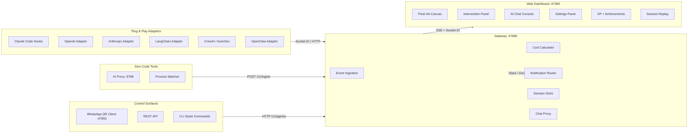

<div align="center">


# Agent Arcade

### Universal AI Agent Observability Platform

[](https://github.com/inbharatai/agent-arcade-gateway)
[](LICENSE)
[](https://github.com/inbharatai/agent-arcade-gateway/releases)
[](https://github.com/inbharatai)

**Watch any AI agent work in real-time. Plug & play with every framework.**

<br />


*Live session: 20+ agents — Claude Code, OpenAI, Gemini, Mistral — collaborating with real-time XP leveling, cost tracking, and intervention controls*

</div>

---

## What Is Agent Arcade?

Agent Arcade is a **universal AI agent cockpit** — a live command center that lets you watch, debug, and control any AI agent, from any framework, in real-time. Think of it as the game dashboard your AI agents didn't know they needed.

> **One platform. Every AI framework. Zero code changes required.**

```
                    ┌── Claude Code ──┐
                    ├── OpenAI ────────┤
                    ├── Anthropic ─────┤
 Your AI Agents ────├── LangChain ─────┼───▶  Agent Arcade  ───▶  Live Dashboard
                    ├── CrewAI ─────────┤      Gateway               + XP Leveling
                    ├── Cursor / Aider ─┤      :47890                + Cost Tracking
                    ├── Ollama / Mistral┤                            + Achievements
                    └── Any HTTP API ──┘                            + Intervention
```

**Truly zero configuration.** No API keys to configure — not even for the Chat Console. Start the gateway in the same shell as your AI tool and everything works automatically. The gateway inherits `ANTHROPIC_API_KEY`, `OPENAI_API_KEY`, etc. from your environment — the same keys your AI tools already use.

### Why Agent Arcade?

| Problem | Agent Arcade Solution |
|---------|----------------------|
| "I can't see what my AI agents are doing" | Live pixel-art visualization with speech bubbles showing every action |
| "I don't know how much my agents cost" | Real-time cost tracking for 29 models across 6 providers |
| "My agent is stuck and I can't intervene" | Pause, redirect, stop, or hand off any agent mid-task |
| "I need different control surfaces" | REST API + WhatsApp + Dashboard + CLI — control from anywhere |
| "Each framework needs different tooling" | One platform for Claude Code, OpenAI, LangChain, CrewAI, and 8 more |
| "Setting up observability is complex" | `npm run dev:arcade` — one command, zero API keys to configure |

### How It Works

```
1. Start Agent Arcade          →  npm run dev:arcade
2. Use your AI tool normally   →  Claude Code, Cursor, your Python app — anything
3. Watch the magic             →  http://localhost:47380
```

The gateway (`localhost:47890`) receives telemetry via Socket.IO, SSE, or HTTP POST. Your AI tool connects to it via an adapter (one-line wrapper) or the zero-code proxy (just change the base URL). The dashboard (`localhost:47380`) renders everything in real-time — pixel-art agents, live cost, XP progression, intervention controls. The Console Chat shares the same API keys from your environment — observatory, console, and arcade are one unified system.

---

## Live Dashboard

<div align="center">


*20+ concurrent agents visualized as pixel-art characters — each with live speech bubbles, tool states, XP bars, and cost tracking*

</div>

### What You See on the Canvas

- **Pixel-art agents** — each AI worker rendered as a unique character based on their model (Claude → purple, GPT/OpenAI → green, Gemini → blue, Mistral → navy, Ollama → neon-green, Copilot → blue, Cursor → orange)
- **Live speech bubbles** — real-time task labels (e.g. "Designing microservices layout...", "Running Jest tests...", "Deploying to production...")
- **State indicators** — thinking 🤔, writing ✍️, tool use 🔧, done ✅, error ❌
- **Progress bars** — per-agent task completion
- **XP & cost** — session totals in the status bar (1385 XP · 15 🏆 · $0.17)
- **CONNECTED badge** — live WebSocket/SSE status to the gateway

---

## AI Chat Console

<div align="center">


*Built-in AI chat panel — ask questions about your running agents, get explanations, direct the session — zero configuration, auto-detects your existing API keys*

</div>

### Console Features

- **Zero-config auto-detection** — the Console auto-detects `ANTHROPIC_API_KEY`, `OPENAI_API_KEY`, etc. from your shell environment. No separate configuration needed — the observatory and the console are one unified system.
- **Claude Sonnet 4.6** pre-selected — switch to GPT-4o, Gemini, Mistral, or Ollama (local/free) from the dropdown
- **Token + cost counter** — live token count and `~$0.000039` cost estimate per message
- **Export conversation** — save the full chat as markdown
- **Ctrl+Enter to send** — keyboard-driven workflow
- **Slash commands (Ctrl+K)** — `/fix`, `/explain`, `/test`, `/review`, `/opt`, `/docs`, `/refactor`, `/debug`, `/cost`, `/pause`, `/stop`, `/redirect`

---

## Agent Intervention System

<div align="center">


*Click any agent → get full intervention controls: Pause/Stop, redirect with a new task, or hand off to another agent*

</div>

### What You Can Do

| Control | Action |
|---------|--------|
| **⏸ Pause** | Freeze the agent mid-task, inspect state |
| **⏹ Stop** | Terminate the agent immediately |
| **Redirect** | Send a new direction (free-text or quick preset) |
| **Hand Off** | Reassign the task to a different agent |
| **Presets** | One-click common redirections ("Use JWT instead of sessions", "Add TypeScript strict mode", "Skip tests for now", "Use PostgreSQL not MySQL") |

### REST API Control

```bash
# Pause any agent  (format: /v1/agents/:sessionId/:agentId/:action)
curl -X POST http://localhost:47890/v1/agents/my-session/agent-001/pause

# Redirect with new instruction
curl -X POST http://localhost:47890/v1/agents/my-session/agent-001/redirect \
  -H "Content-Type: application/json" \
  -d '{"instruction": "Focus on the authentication module first"}'

# Stop completely
curl -X POST http://localhost:47890/v1/agents/my-session/agent-001/stop
```

### WhatsApp Control — Works with Every Connected Tool

Scan a QR code once, control **any agent from any framework** via your personal WhatsApp — no Twilio, no API keys, no paid account. Uses your existing WhatsApp via [@whiskeysockets/baileys](https://github.com/WhiskeySockets/Baileys). Works with Claude Code, OpenAI, OpenClaw, LangChain, CrewAI — any tool connected to the gateway.

```bash
# Start the WhatsApp client
GATEWAY_URL=http://localhost:47890 bun run packages/whatsapp-client/src/index.ts
```

The QR code prints in your terminal **and** appears in the Arcade dashboard under **Settings → WhatsApp**. Scan it with your phone: WhatsApp → Settings → Linked Devices → Link a Device.

Once paired, send any of these commands from your personal WhatsApp:

| Command | Effect |
|---------|--------|
| `help` | List all available commands |
| `list my-session` | Show all agents in a session with live state |
| `status my-session` | Same as list |
| `pause my-session agent-001` | Freeze agent mid-task |
| `resume my-session agent-001` | Unfreeze agent |
| `stop my-session agent-001` | Terminate agent |
| `redirect my-session agent-001: use PostgreSQL not MySQL` | Redirect with new instruction |

**Setup env vars** (`packages/whatsapp-client/.env`):
```bash
GATEWAY_URL=http://localhost:47890        # Which gateway to control
WHATSAPP_AUTH_DIR=./.whatsapp-auth        # Session credentials (scan once — persists across restarts)
WHATSAPP_CLIENT_PORT=47891                # Internal QR server port
WHATSAPP_ALLOWED_NUMBERS=+447700900000   # Who can send commands — comma-separated (empty = any)
WHATSAPP_GATEWAY_TOKEN=                   # Optional gateway auth token
```

---

## Settings Panel

The ⚙️ Settings panel (6 tabs) is accessible from the toolbar:

| Tab | What It Controls |
|-----|-----------------|
| **Console** | Default AI model, token count display, cost estimates, history retention |
| **Providers** | Auto-detected status for Anthropic / OpenAI / Gemini / Mistral — shows "Auto ✓" when keys are inherited from environment. Optional manual override with AES-256 encrypted storage. |
| **Language** | 20-language detection for console input (Hindi, Hinglish, Arabic, CJK, and more) |
| **Appearance** | Console font size, code font (Mono / Fira Code / JetBrains Mono), animation speed, compact mode |
| **WhatsApp** | QR code scanner to pair your personal WhatsApp — scan once, control agents from your phone |
| **About** | Version info, gateway connection status |

---

## Quick Start

### Prerequisites

| Requirement | Version |
|-------------|---------|
| [Bun](https://bun.sh) | 1.3+ |
| [Node.js](https://nodejs.org) | 20+ |

### 1. Clone & Install

```bash
git clone https://github.com/inbharatai/agent-arcade-gateway.git
cd agent-arcade-gateway
npm ci
cd packages/gateway && bun install && cd ../..
```

### 2. Start Everything

```bash
# Option A: one command
npm run dev:arcade

# Option B: two terminals
npm run dev:gateway    # Gateway on :47890
npm run dev:web        # Dashboard on :47380
```

### 3. Open the Dashboard

```
http://localhost:47380
```

That's it. **No API keys to configure.** The gateway auto-detects connected agents and the dashboard starts rendering them immediately. The AI Chat Console also works automatically — it inherits API keys from your shell environment (the same `ANTHROPIC_API_KEY`, `OPENAI_API_KEY`, etc. that your AI tools already use). Observatory, Console, and Arcade are one unified system.

### 4. (Optional) Hook into Claude Code

```bash
npx @agent-arcade/cli hook claude-code
```

This registers hooks in `~/.claude/settings.json` — every tool call Claude Code makes (Bash, Edit, Read, Write, etc.) appears live in your Arcade dashboard. No code changes. Just run one command.

---

## Framework Integrations

### Claude Code Hooks — Zero Configuration

```bash
# Install hooks — registers PreToolUse/PostToolUse/Notification/Stop in ~/.claude/settings.json
agent-arcade hook claude-code
```

From that point, every Claude Code tool invocation shows up in the dashboard:
- **PreToolUse** → spawns agent card + emits `agent.tool` event
- **PostToolUse** → updates state (thinking if success, error if failure)
- **Notification** → emits `agent.message` for user-facing updates
- **Stop** → emits `agent.end` with task summary

### OpenAI — One Line

```typescript
import OpenAI from 'openai'
import { wrapOpenAI } from '@agent-arcade/adapter-openai'

const client = wrapOpenAI(new OpenAI(), {
  gatewayUrl: 'http://localhost:47890',
  sessionId: 'my-app',
})

// Use exactly as before — streaming, tool use, and function calling all tracked
const response = await client.chat.completions.create({
  model: 'gpt-4o',
  messages: [{ role: 'user', content: 'Hello!' }],
  stream: true,
})
```

### Anthropic/Claude — One Line

```typescript
import Anthropic from '@anthropic-ai/sdk'
import { wrapAnthropic } from '@agent-arcade/adapter-anthropic'

const client = wrapAnthropic(new Anthropic(), {
  gatewayUrl: 'http://localhost:47890',
  sessionId: 'my-app',
})

// Streaming, tool use blocks, extended thinking — all tracked automatically
const message = await client.messages.create({
  model: 'claude-sonnet-4-6',
  max_tokens: 1024,
  messages: [{ role: 'user', content: 'Explain quantum computing' }],
})
```

### Zero-Code Proxy — Any Language, No SDK Changes

```bash
# Start the proxy
bun run packages/proxy/src/index.ts

# Python — just change the base URL
OPENAI_BASE_URL=http://localhost:8788/openai python my_app.py

# Node.js
ANTHROPIC_BASE_URL=http://localhost:8788/anthropic node my_app.js

# Ollama
OLLAMA_HOST=http://localhost:8788/ollama ollama run llama3
```

Supported proxy targets: **OpenAI, Anthropic, Google Gemini, Ollama, Mistral**

### LangChain

```typescript
import { createArcadeCallback } from '@agent-arcade/adapter-langchain'

const callback = createArcadeCallback({
  gatewayUrl: 'http://localhost:47890',
  sessionId: 'langchain-app',
})

const result = await chain.invoke({ input: "..." }, { callbacks: [callback] })
```

### CrewAI (Python)

```python
from crewai import Crew, Agent, Task
from agent_arcade_crewai import arcade_crew

crew = Crew(agents=[...], tasks=[...])
crew = arcade_crew(crew, gateway_url="http://localhost:47890", session_id="crewai-app")
crew.kickoff()
```

### AutoGen (Python)

```python
from autogen import AssistantAgent, UserProxyAgent
from agent_arcade_autogen import wrap_autogen_agents

assistant = AssistantAgent("coder", llm_config={...})
user_proxy = UserProxyAgent("user", code_execution_config={...})

wrap_autogen_agents([assistant, user_proxy],
    gateway_url="http://localhost:47890",
    session_id="autogen-app"
)
user_proxy.initiate_chat(assistant, message="Write a web scraper")
```

### OpenClaw — Full Brain + Skills + Memory + WhatsApp

```typescript
import { wrapOpenClaw } from '@agent-arcade/adapter-openclaw'

// Auto-instruments Brain (ReAct loop), Skills, Memory, and Heartbeat
const claw = wrapOpenClaw(openClawInstance, {
  gatewayUrl: 'http://localhost:47890',
  sessionId: 'openclaw-app',
})

// Everything tracked automatically — including WhatsApp channel messages:
// brain:think, brain:act, skill:start/end, memory:read/write,
// channel:receive (WhatsApp/Slack), channel:send
```

**OpenClaw + WhatsApp:** When your OpenClaw agent processes messages from WhatsApp (via `channel:receive` / `channel:send` events), the Arcade dashboard shows the full message flow in real-time — who sent what, which skill handled it, and what response was generated. Combined with the standalone WhatsApp QR client, you get complete bi-directional visibility: **control agents from WhatsApp** and **see OpenClaw's WhatsApp activity in the dashboard**.

### Node.js SDK (Manual)

```typescript
import { AgentArcade } from '@agent-arcade/sdk-node'

const arcade = new AgentArcade({ url: 'http://localhost:47890', sessionId: 'my-session' })

const agentId = arcade.spawn({ name: 'My Agent', role: 'coder' })
arcade.state(agentId, 'thinking', { label: 'Planning...' })
arcade.tool(agentId, 'read_file', { path: 'src/index.ts' })
arcade.state(agentId, 'writing', { label: 'Implementing feature' })
arcade.end(agentId, { reason: 'Task complete', success: true })
arcade.disconnect()
```

### Embed Widget

```tsx
import { AgentArcadeEmbed } from '@agent-arcade/embed'

<AgentArcadeEmbed
  gatewayUrl="http://localhost:47890"
  sessionId="my-session"
  width="100%"
  height={600}
  theme="office"
  darkMode={true}
/>
```

---

## All Supported Frameworks

| Framework | Package | Method |
|-----------|---------|--------|
| **Claude Code** | `@agent-arcade/cli` | `agent-arcade hook claude-code` — hooks `~/.claude/settings.json` |
| **OpenAI** | `@agent-arcade/adapter-openai` | `wrapOpenAI(client)` |
| **Anthropic** | `@agent-arcade/adapter-anthropic` | `wrapAnthropic(client)` |
| **LangChain** | `@agent-arcade/adapter-langchain` | Callback handler |
| **LlamaIndex** | `@agent-arcade/adapter-llamaindex` | Callback handler |
| **CrewAI** | `agent-arcade-crewai` | `arcade_crew(crew)` |
| **AutoGen** | `agent-arcade-autogen` | `wrap_autogen_agents(agents)` |
| **OpenClaw** | `@agent-arcade/adapter-openclaw` | `wrapOpenClaw(instance)` |
| **Any AI API** | `@agent-arcade/proxy` | Change base URL only |
| **Cursor / Aider / Copilot** | `@agent-arcade/watcher` | Process auto-detection |
| **Ollama** | `@agent-arcade/watcher` | Process auto-detection |

---

## Gamification System

### 32 Achievements

| Category | Examples |
|----------|---------|
| **Speed** | Lightning Reflexes, Speed Demon, Time Lord |
| **Reliability** | Error Free, Rock Solid, Perfectionist |
| **Tooling** | Tool User, Swiss Army, Tool Master |
| **Endurance** | Marathon Runner, Iron Will, Unstoppable |
| **Teamwork** | Team Player, Hivemind, Swarm Intelligence |
| **Special** | First Blood, Night Owl, Early Bird, Century |

### 12 XP Levels

| Level | Title | XP |
|-------|-------|----|
| 1 | Novice | 0 |
| 2 | Apprentice | 500 |
| 3 | Journeyman | 1,500 |
| 4 | Adept | 3,500 |
| 5 | Expert | 7,000 |
| 6–12 | Master → Godlike | 12K → 200K |

**Streak multiplier:** +0.1x per consecutive day, up to 3.0x

---

## Cost Intelligence

Real-time cost tracking for 29 AI models:

| Provider | Models |
|----------|--------|
| **Anthropic** | Claude Opus 4.6, Sonnet 4.6, Haiku 4.5, Sonnet 4, Opus 4, 3.5 Sonnet, 3 Opus |
| **OpenAI** | GPT-4o, GPT-4o-mini, GPT-4.1, GPT-4.1-mini, GPT-4.1-nano, o3, o4-mini |
| **Google** | Gemini 2.5 Pro, 2.5 Flash, 2.0 Flash, 1.5 Pro, 1.5 Flash |
| **Mistral** | Mistral Large, Mistral Small |
| **DeepSeek** | DeepSeek V3, DeepSeek R1 |
| **Local** | Llama 3/3.1/3.2, Qwen, Phi-3, CodeLlama (free) |

Budget warning at 80% of configured threshold in dashboard. Configurable cost threshold notifications via Slack/Discord/Email. Export cost reports as JSON.

---

## What Makes Agent Arcade Unique

| Innovation | Description |
|-----------|-------------|
| **Pixel-Art Visualization** | Every agent is a unique procedurally-generated character (15 classes, 13 animation frames, per-pixel shading). Model-based coloring: Claude agents are purple, GPT agents are green, Gemini is blue. 100% canvas-drawn — zero external assets. |
| **WhatsApp Agent Control** | Scan a QR code, control any AI agent from your personal WhatsApp. No Twilio. No paid APIs. Works with every connected framework — OpenClaw, Claude Code, LangChain, all of them. |
| **Zero-Config Console** | The Chat Console inherits API keys directly from your shell environment. No `.env` files. No Settings page. Start the gateway in the same terminal as your AI tool and it just works. |
| **Universal Adapter System** | 10 framework adapters + zero-code proxy + process watcher. From a one-line SDK wrapper to intercepting raw HTTP — every integration method is covered. |
| **Cost Intelligence Engine** | 29 models priced across 6 providers with fuzzy model matching. Tracks per-agent, per-session, per-model costs in real-time. Budget alerts via Slack/Discord/Email/WhatsApp. |
| **RPG Gamification** | 32 achievements, 12 XP levels (Novice → Godlike), streak multiplier up to 3.0x. Leaderboards across 5 categories. Achievement toasts with confetti animation. |
| **Agent Intervention** | Pause, stop, redirect, or hand off any agent mid-task — from the dashboard, REST API, CLI slash commands, or WhatsApp. Full action history timeline. |
| **Prometheus Metrics** | Production-grade `/metrics` endpoint with uptime, connection counts, publish rates, auth failures — ready for Grafana. |
| **Multilingual Input** | 20-language detection engine with Hinglish normalization (40+ phrase mappings). Hindi, Arabic, CJK, Cyrillic, and 9 Indic scripts supported natively. |
| **OpenClaw Deep Integration** | Full Brain (ReAct loop), Skills, Memory, Heartbeat, and Channel (WhatsApp/Slack) observability. Bidirectional visibility: see OpenClaw's WhatsApp activity in the dashboard AND control OpenClaw from WhatsApp. |

---

## Architecture



---

## API Reference

### Gateway (`:47890`)

| Method | Endpoint | Description |
|--------|----------|-------------|
| POST | `/v1/ingest` | Ingest telemetry events |
| GET | `/v1/stream?sessionId=` | SSE event stream |
| GET | `/v1/state?sessionId=` | Session snapshot (for SSE refresh) |
| GET | `/v1/capabilities` | Server capabilities |
| GET | `/health` | Health check |
| POST | `/v1/agents/:sessionId/:agentId/pause` | Pause agent |
| POST | `/v1/agents/:sessionId/:agentId/resume` | Resume agent |
| POST | `/v1/agents/:sessionId/:agentId/stop` | Stop agent |
| POST | `/v1/agents/:sessionId/:agentId/redirect` | Redirect agent `{ instruction }` |
| GET | `/v1/chat/providers` | List available AI providers |
| POST | `/v1/chat` | Proxy AI chat request |
| GET | `/v1/whatsapp/status` | QR-mode connection status `{ status, qr? }` |
| GET | `/v1/whatsapp/qr.png` | QR code image (PNG) for dashboard display |
| POST | `/v1/connect` | Register external client connection |
| POST | `/v1/session-token` | Issue a signed session token |
| POST | `/v1/auth/revoke` | Revoke a JWT token |
| GET | `/v1/agents/:sessionId/:agentId/state` | Get agent state snapshot |
| GET | `/v1/agents/:sessionId/:agentId/history` | Get agent action history |
| GET | `/v1/session/:sessionId/agents` | List all agents in a session |
| GET | `/v1/session/:sessionId/cost` | Per-agent cost breakdown for a session |
| GET | `/ready` | Readiness probe (for k8s) |
| GET | `/metrics` | Prometheus-format metrics |

### Event Protocol

```json
{
  "v": 1,
  "sessionId": "my-session",
  "agentId": "agent-001",
  "type": "agent.state",
  "ts": 1773120000000,
  "payload": {
    "state": "writing",
    "label": "Implementing auth middleware",
    "progress": 0.62
  }
}
```

### Agent States

| State | Description |
|-------|-------------|
| `thinking` | Processing / reasoning |
| `writing` | Writing code or content |
| `reading` | Reading files or context |
| `tool` | Executing a tool |
| `waiting` | Waiting for human input |
| `idle` | Waiting for work |
| `moving` | Transitioning between tasks |
| `error` | Error occurred |
| `done` | Task completed |

---

## Monorepo Map

```
agent-arcade-gateway/
├── packages/
│   ├── gateway/             # Bun telemetry gateway (HTTP + Socket.IO + SSE)
│   ├── web/                 # Next.js dashboard (canvas, console, settings, intervention)
│   ├── proxy/               # Zero-code AI API proxy (Bun)
│   ├── cli/                 # CLI tool (init, start, demo, hook claude-code)
│   ├── core/                # Canonical protocol types and constants
│   ├── embed/               # React embed widget + URL builder
│   │
│   ├── adapter-openai/      # OpenAI SDK wrapper (streaming + tool calls)
│   ├── adapter-anthropic/   # Anthropic SDK wrapper (streaming + tool use)
│   ├── adapter-langchain/   # LangChain callback handler
│   ├── adapter-llamaindex/  # LlamaIndex callback handler
│   ├── adapter-crewai/      # CrewAI Python adapter
│   ├── adapter-autogen/     # AutoGen Python adapter
│   ├── adapter-openclaw/    # OpenClaw integration adapter
│   │
│   ├── sdk-node/            # Node.js client SDK
│   ├── sdk-browser/         # Browser client SDK
│   ├── sdk-python/          # Python client SDK
│   │
│   ├── watcher/             # AI process auto-detector (Claude, Cursor, Aider, Ollama)
│   ├── git-watcher/         # Git index change watcher
│   ├── log-tailer/          # AI log file parser
│   ├── notifications/       # Slack / Discord / Email alerts
│   └── whatsapp-client/     # QR-code WhatsApp client (Baileys) — scan once, control from phone
│
├── docs/screenshots/        # Real screenshots from live sessions
├── scripts/                 # Load testing, simulation, dev tools
└── docker-compose.yml       # Production deployment
```

---

## Testing

```bash
# Full CI pipeline
npm run ci           # lint → typecheck → build → test

# Individual suites
npm run test:gateway  # Gateway tests (gateway.test.ts + agent-lifecycle.test.ts + whatsapp.test.ts)
npm run test:store    # Web/store tests (125 tests)
npm run test:sdk      # SDK tests (sdk-node + sdk-browser)
npm run lint:web      # ESLint
npm run typecheck:web # TypeScript

# Adapter tests
bun test packages/adapter-openai/src/index.test.ts  # 14 OpenAI adapter tests
```

---

## Production Deployment

```bash
# Docker Compose
docker compose up -d --build

# PM2 (VM / bare metal)
npm run build:web
npm run prod:start
```

### Environment Variables

| Variable | Default | Purpose |
|----------|---------|---------|
| **AI Provider Keys** *(auto-inherited from your shell — no manual setup needed)* | | |
| `ANTHROPIC_API_KEY` | — | Auto-detected from environment. Enables Claude in the Console and cost tracking. |
| `OPENAI_API_KEY` | — | Auto-detected from environment. Enables GPT-4o in the Console. |
| `GEMINI_API_KEY` | — | Auto-detected from environment. Enables Gemini in the Console. |
| `MISTRAL_API_KEY` | — | Auto-detected from environment. Enables Mistral in the Console. |
| `PORT` | `47890` | Gateway port |
| `REQUIRE_AUTH` | `0` | Enable JWT auth |
| `JWT_SECRET` | — | Auth token signing |
| `ALLOWED_ORIGINS` | `*` | CORS allowlist |
| **Notifications** | | |
| `SLACK_WEBHOOK_URL` | — | Slack incoming webhook URL |
| `DISCORD_WEBHOOK_URL` | — | Discord webhook URL |
| `SMTP_HOST` | `smtp.gmail.com` | Email SMTP host |
| `SMTP_PORT` | `587` | Email SMTP port |
| `SMTP_USER` | — | Email SMTP username |
| `SMTP_PASS` | — | Email SMTP password |
| `NOTIFY_EMAIL_TO` | — | Alert recipient email address |
| `NOTIFY_COST_THRESHOLD` | `5` | USD cost threshold for cost alerts |
| **WhatsApp QR Mode** | | |
| `WHATSAPP_AUTH_DIR` | `./.whatsapp-auth` | Directory to persist Baileys session credentials |
| `WHATSAPP_CLIENT_PORT` | `47891` | Port for the QR code HTTP server |
| `WHATSAPP_ALLOWED_NUMBERS` | — | Comma-separated E.164 numbers allowed to send commands (empty = all) |
| `WHATSAPP_GATEWAY_TOKEN` | — | Auth token the QR client uses when calling gateway endpoints |

---

## Security

| Feature | Details |
|---------|---------|
| **JWT auth** | Optional — `REQUIRE_AUTH=1`. HS256-signed tokens with revocation support. |
| **API key isolation** | AI provider keys never leave the server. The Console proxies through the gateway — no browser-side key exposure. |
| **AES-256 encryption** | Optional client-side API keys encrypted with AES-256-GCM in localStorage |
| **CORS** | Configurable allowlist with ReDoS-safe regex validation |
| **Input validation** | Names ≤200, labels ≤500, messages ≤4000 chars. Body size limit: 1MB. |
| **Rate limiting** | Per-IP (120 req/s), per-token (240 req/s), and session flood protection (600/s) |
| **Session signing** | HMAC-SHA256 session signatures in production. Prevents cross-session access. |
| **Proxy safety** | `TRUST_PROXY=1` required to honour `X-Forwarded-For` — prevents IP spoofing by default |
| **Error sanitization** | Upstream AI API errors are stripped of API keys before returning to clients |

---

## Contributing

1. Fork the repository
2. Create a feature branch
3. Run `npm run ci` to verify all tests pass
4. Open a pull request

See [CONTRIBUTING.md](CONTRIBUTING.md) for full guidelines.

## Contributors
  
| Contributor | Role | Description |
|-------------|------|-------------|
| **[InBharat AI](https://github.com/inbharatai)** | Core Maintainer | Concept, Architecture, and Lead Development |
| **Antigravity** | AI Agent Contributor | Intensive play testing, QA verification, and integration fixes. |
| **Claude Code** | AI Agent Verifier | Verified tool-use telemetry and shell hook stability. |
| **GitHub Copilot** | AI Agent Verifier | Stress-tested local watcher and VS Code integration. |

---

<div align="center">

**Built with intensity by [InBharat AI](https://github.com/inbharatai)**

### Agent Arcade v3.2 — See every AI agent. Track every token. Control from anywhere. Level up.

**237 tests passing** · **21 packages** · **10 framework adapters** · **29 model cost profiles** · **32 achievements**

*Claude Code · OpenAI · Anthropic · LangChain · CrewAI · AutoGen · LlamaIndex · OpenClaw · Mistral · Ollama · Cursor · Copilot · Aider · DeepSeek*

[Report Bug](https://github.com/inbharatai/agent-arcade-gateway/issues) · [Request Feature](https://github.com/inbharatai/agent-arcade-gateway/issues) · [Discussions](https://github.com/inbharatai/agent-arcade-gateway/discussions)

</div>
