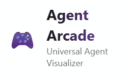
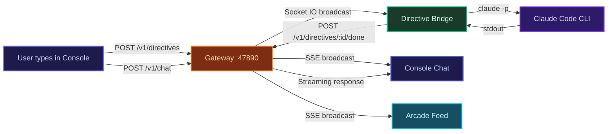
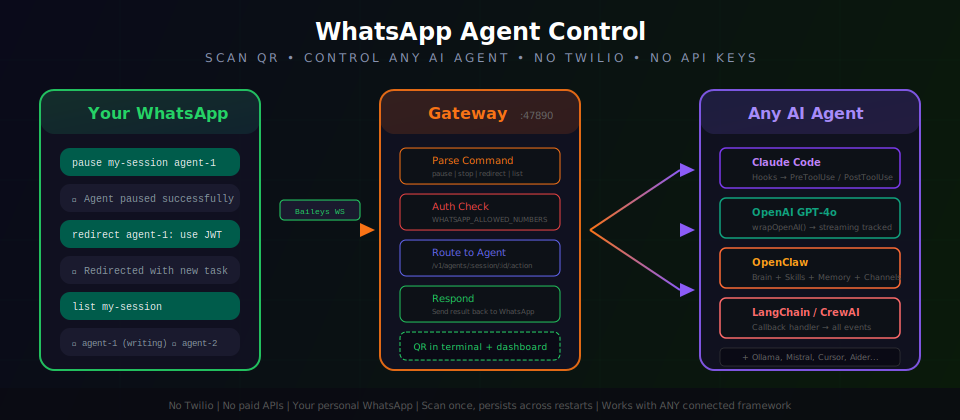
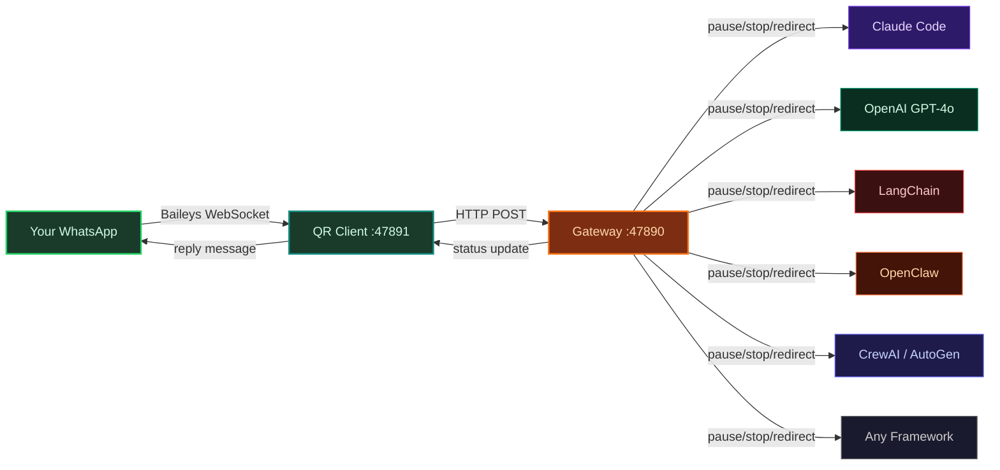
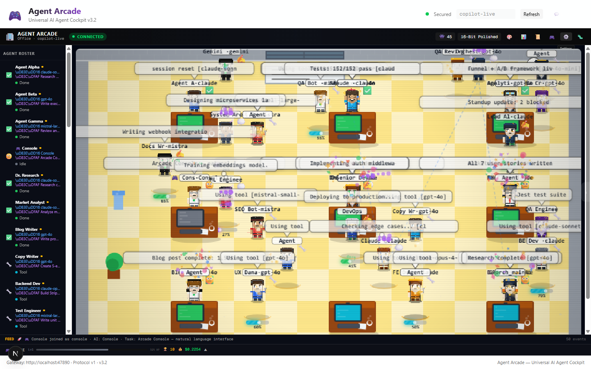
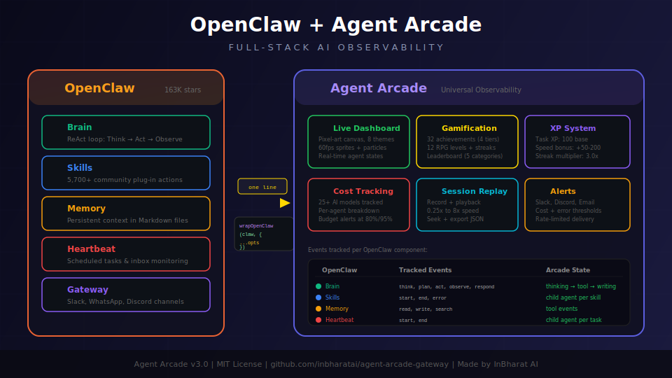
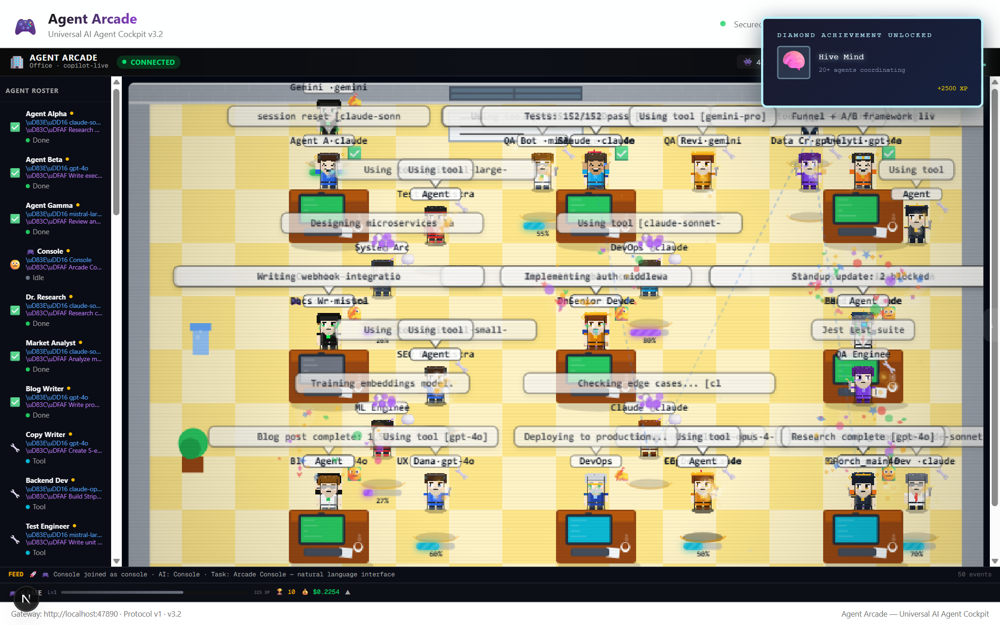
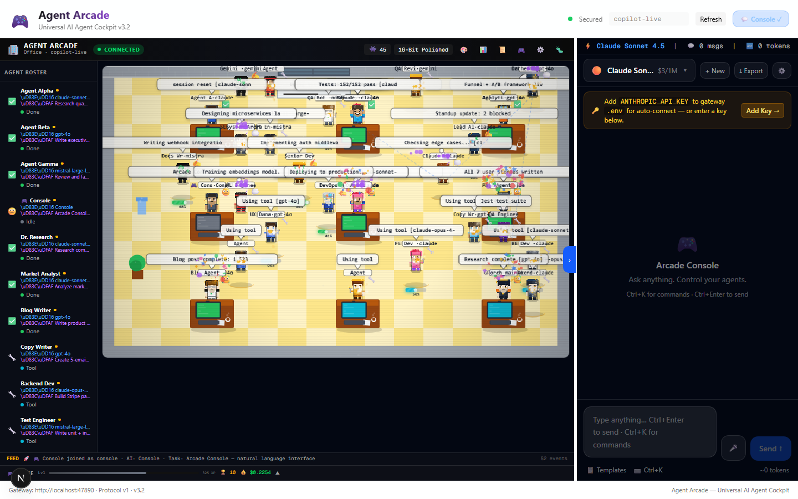
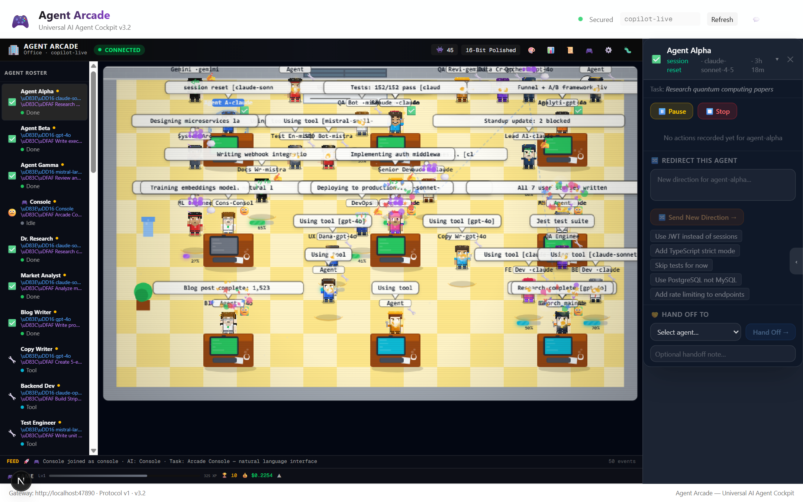
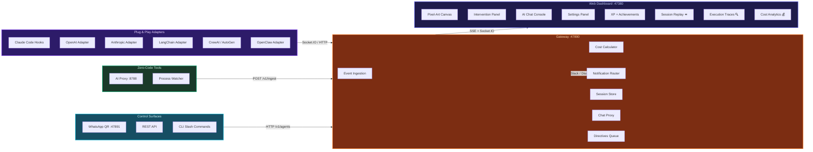

<div align="center">



# Agent Arcade

### Universal AI Agent Observability Platform

[](https://github.com/inbharatai/agent-arcade-gateway)
[](LICENSE)
[](https://github.com/inbharatai/agent-arcade-gateway/releases)
[](https://github.com/inbharatai)

[](#-goal-mode)
[](#-whatsapp-agent-control--universal-remote-for-every-ai-agent)
[](#-openclaw--deepest-ai-brain-observability)
[](#what-is-agent-arcade)

[](#directive-bridge--console--ai-tool-loop)
[](#-execution-traces)
[](#-session-replay)
[](#-cost-analytics)

[](#-quick-start)
[](#crewai-python)
[](#autogen-python)

[](#-hosted-demo--one-click-deploy)
[](#-hosted-demo--one-click-deploy)

**Watch any AI agent work in real-time. Plug & play with every framework.**

<br />


*Multiple agents — Claude Code, OpenAI, Gemini, Mistral — visualized with real-time XP leveling, cost tracking, and intervention controls*

</div>

---

## Table of Contents

- [What Is Agent Arcade?](#what-is-agent-arcade)
- [Directive Bridge](#-directive-bridge--console--ai-tool-loop)
- [WhatsApp Agent Control](#-whatsapp-agent-control--universal-remote-for-every-ai-agent)
- [OpenClaw Deep Integration](#-openclaw--deepest-ai-brain-observability)
- [Live Dashboard](#-live-dashboard)
- [AI Chat Console](#-ai-chat-console)
- [Agent Intervention System](#%EF%B8%8F-agent-intervention-system)
- [Goal Mode](#-goal-mode)
- [Execution Traces](#-execution-traces)
- [Session Replay](#-session-replay)
- [Cost Analytics](#-cost-analytics)
- [Settings Panel](#%EF%B8%8F-settings-panel)
- [Quick Start](#-quick-start)
- [Framework Integrations](#-framework-integrations)
- [All Supported Frameworks](#-all-supported-frameworks)
- [Gamification System](#-gamification-system)
- [Audio & Voice System](#-audio--voice-system)
- [What Makes Agent Arcade Unique](#-what-makes-agent-arcade-unique)
- [Architecture](#%EF%B8%8F-architecture)
- [API Reference](#-api-reference)
- [Monorepo Map](#-monorepo-map)
- [Testing](#-testing)
- [Hosted Demo — One-Click Deploy](#-hosted-demo--one-click-deploy)
- [Production Deployment](#-production-deployment)
- [Environment Variables](#environment-variables)
- [Security](#-security)
- [Recent Changes](#-recent-changes-v321--v370)
- [Contributing](#-contributing)

---

## What Is Agent Arcade?

Agent Arcade is a **universal AI agent cockpit** — a live command center that lets you watch, debug, and control any AI agent, from any framework, in real-time. Think of it as the game dashboard your AI agents didn't know they needed.

> **One platform. Every AI framework. Minimal integration — one-line adapter or a base-URL change.**

> **How much code?** Using the HTTP proxy (change your AI tool's base URL) = zero code changes. Using an SDK adapter (LangChain, CrewAI, AutoGen, etc.) = one line. Using the gateway directly = a few lines of HTTP POST. All three paths are supported.

<table align="center">
<tr>
<td align="center" width="280">

**Your AI Agents**

[](#)
[](#)
[](#)
[](#)
[](#)
[](#)
[](#)
[](#)
[](#)
[](#)
[](#)

</td>
<td align="center" width="60">

**>>>**

*Socket.IO*
*SSE*
*HTTP*

</td>
<td align="center" width="200">

**Gateway**
**`:47890`**

Event Ingestion
Cost Calculator
Notification Router
Chat Proxy
Directives Queue

</td>
<td align="center" width="60">

**>>>**

*Real-time*

</td>
<td align="center" width="220">

**Live Dashboard**
**`:47380`**

Pixel-Art Canvas
XP & Achievements
Execution Traces 🔍
Session Replay ⏪
Cost Analytics 💰
Agent Intervention
AI Chat Console

</td>
</tr>
</table>

**Minimal configuration.** No API keys to configure for the Chat Console — start the gateway in the same shell as your AI tool and the Console works automatically. The gateway inherits `ANTHROPIC_API_KEY`, `OPENAI_API_KEY`, etc. from your environment — the same keys your AI tools already use. It also **auto-detects Claude Code OAuth credentials** from `~/.claude/.credentials.json`, so if you have a Claude Max/Pro subscription, the Console works instantly — no key needed. The Console **auto-detects which AI model your agents are using** and selects it automatically — no manual model switching needed. If no key is found in the environment, an **inline API key entry** appears directly in the Console banner — paste your key and start chatting without navigating to Settings.

### Why Agent Arcade?

| Problem | Agent Arcade Solution |
|---------|----------------------|
| "I can't see what my AI agents are doing" | Live pixel-art visualization with speech bubbles showing every action |
| "I don't know how much my agents cost" | Real-time cost tracking with per-model breakdown, budget alerts, and historical charts |
| "My agent is stuck and I can't intervene" | Pause, redirect, stop, or hand off any agent mid-task |
| "I need different control surfaces" | REST API + WhatsApp + Dashboard + CLI — control from anywhere |
| "Each framework needs different tooling" | One platform for Claude Code, OpenAI, LangChain, CrewAI, and 8 more |
| "My console can't talk back to my AI tool" | Directive Bridge: Console/WhatsApp commands execute on Claude Code and the response shows in chat |
| "I have to configure the console model manually" | Console auto-detects the AI model from your running agents and inherits API keys |
| "Setting up observability is complex" | `npm run dev:arcade` — one command, zero API keys to configure |
| "I need to manually enter my API key" | Auto-detects Claude Code OAuth subscription tokens + inline key entry in the Console banner |
| "My console shows stale messages from the last session" | Fresh session on every mount — no stale history on new connections |
| "I want span-level tracing without a third-party account" | Hierarchical span tree with search, error highlighting, and side-by-side comparison — self-hosted, no account needed |
| "I need session replay to debug what my agent did" | DVR timeline scrubber, per-agent swimlanes, event inspector, failure detection — fully offline, stored in localStorage |
| "I need cost analytics with budget controls" | Per-model breakdown, budget alerts (80% warning + exceeded banner), model × calls table, one-click CSV export |
| "Data is lost when the server restarts" | SQLite persistence — `DB_PATH=./arcade.db` and everything survives restarts, zero extra services |

### How It Works

```
 +======================================================================+
 |  1. START     ->  npm run dev:arcade                                 |
 |  2. USE AI    ->  Claude Code, Cursor, your Python app               |
 |  3. WATCH     ->  http://localhost:47380                             |
 +======================================================================+
```

The gateway (`localhost:47890`) receives telemetry via Socket.IO, SSE, or HTTP POST. Your AI tool connects to it via an adapter (one-line wrapper) or the zero-code proxy (just change the base URL). The dashboard (`localhost:47380`) renders everything in real-time — pixel-art agents, live cost, XP progression, intervention controls. The Console auto-detects the AI model your agents are using and inherits API keys from the environment (including Claude Code OAuth tokens from `~/.claude/.credentials.json`). Every Console message is also pushed to the **Directives Queue** (`/v1/directives`), which connected tools like Claude Code can poll and execute — closing the loop between the human operator and the AI agent. The **Directive Bridge** (`directive-bridge.ts`) polls the queue, executes commands via `claude -p`, and posts responses back — the Console shows the AI's response in real-time alongside its own chat stream. The WhatsApp QR client auto-starts with the gateway — scan once and control any agent from your phone. Message yourself on WhatsApp to chat with AI via the **self-chat relay** — your message is routed to the gateway, executed, and the response appears both in WhatsApp and the Arcade feed. Observatory, console, WhatsApp, directives, bridge, and arcade are one unified system — **everything is interlinked**.

---

## Directive Bridge — Console ↔ AI Tool Loop

<div align="center">

> **Type in the Console. Claude Code executes it. The response shows in the Console chat. Everything is interlinked.**

</div>

The Directive Bridge is the key piece that makes Agent Arcade a **true universal control panel** — not just an observer. When you send a message in the Console (or WhatsApp), three things happen simultaneously:

1. **Direct chat** — the Console streams an AI response from the selected model (Claude, GPT-4o, Gemini, etc.)
2. **Directive pushed** — the message is queued as a directive at `/v1/directives`
3. **Bridge executes** — the Directive Bridge polls the queue, runs `claude -p`, and posts the response back via `/v1/directives/:id/done`
4. **SSE broadcast** — the gateway broadcasts the response to all listeners — the Console chat shows it as a message from "🤖 Claude Code"



### Starting the Bridge

```bash
# Starts automatically with dev:arcade, or run manually:
GATEWAY_URL=http://localhost:47890 bun run packages/gateway/src/directive-bridge.ts
```

The bridge registers as a **🤖 Claude Code** agent in the Arcade — visible on the pixel-art canvas with state transitions (thinking → idle) and telemetry events.

### Agent Name Mapping

The Console maps known agent IDs to friendly display names:

| Agent ID | Display Name |
|----------|-------------|
| `claude-code-main` | 🤖 Claude Code |
| `whatsapp-relay` | 📱 WhatsApp AI |
| `cursor-main` | 📝 Cursor |
| `openai-main` | 🧠 OpenAI |
| `gemini-main` | 💎 Gemini |
| `crewai-main` | 👥 CrewAI |
| `autogen-main` | 🔄 AutoGen |
| `langchain-main` | 🔗 LangChain |
| `openclaw-main` | 🦞 OpenClaw |

Any new tool can integrate by: (1) emitting telemetry to `/v1/ingest`, (2) polling `/v1/directives`, and (3) posting responses to `/v1/directives/:id/done`.

---

## WhatsApp Agent Control — Universal Remote for Every AI Agent

<div align="center">



</div>

<br />

> **Your phone becomes a universal remote control for every AI agent running in Agent Arcade.** Claude Code, OpenAI, LangChain, CrewAI, OpenClaw, Cursor, Ollama — if it's connected to the gateway, you can control it from WhatsApp.

This is **not a chatbot** and **not specific to any one framework**. It's a command-line interface delivered over WhatsApp. The WhatsApp client (`packages/whatsapp-client`) connects to the **same gateway REST API** that the dashboard uses (`/v1/agents/:session/:id/:action`). Any agent from any framework that's connected to the gateway is instantly controllable from your phone.

### How the Architecture Works



**The key insight:** WhatsApp messages are parsed into the exact same REST API calls that the dashboard intervention panel uses. `pause my-session agent-001` from WhatsApp is identical to clicking "Pause" on the dashboard. The gateway doesn't know or care where the command came from.

### Three Places to Scan the QR Code

All locations work automatically — the gateway auto-starts the WhatsApp client, no manual process needed.

| Location | How |
|:---------|:----|
| **Dashboard** | Settings -> WhatsApp tab — QR code appears automatically with live status (Starting -> QR -> Connected) |
| **Terminal** | QR code prints directly in the gateway terminal output |
| **HTTP endpoint** | `GET http://localhost:47891/qr.png` serves the QR as a PNG image |

<div align="center">



*The Settings -> WhatsApp tab shows real-time connection status: Starting -> QR displayed -> Connected. The QR code renders directly in the dashboard — scan from your phone's WhatsApp -> Linked Devices.*

</div>

<table>
<tr>
<td width="50%">

### Setup — Fully Automatic

**The gateway auto-starts the WhatsApp client in development mode.** No separate process to manage. Just start the gateway and the QR code appears in your dashboard immediately.

```bash
# Automatic (default in dev mode):
npm run dev:arcade
# -> Gateway starts on :47890
# -> WhatsApp client auto-spawns on :47891
# -> QR code appears in Settings -> WhatsApp tab

# Manual (production or custom setup):
GATEWAY_URL=http://localhost:47890 \
  bun run packages/whatsapp-client/src/index.ts
```

The client uses [@whiskeysockets/baileys](https://github.com/WhiskeySockets/Baileys) — a lightweight, open-source WhatsApp Web library. **No Twilio account. No API keys. No monthly fees.** Scan once, and the session persists across restarts in `.whatsapp-auth/`.

The gateway auto-spawns the WhatsApp client and proxies its status via two endpoints:
- `GET /v1/whatsapp/status` — connection state + QR data URL
- `GET /v1/whatsapp/qr.png` — QR code as PNG image

Auto-start is controlled by `WHATSAPP_QR_MODE` (defaults to `1` in development, `0` in production). The dashboard polls these endpoints to show real-time WhatsApp status — from "Starting..." spinner to live QR code to "Connected" badge — without any extra configuration.

</td>
<td width="50%">

### Commands — Control Any Agent

| Message You Send | What Happens |
|:----------------|:------------|
| `help` | Lists all commands |
| `list my-session` | Shows all agents with live state |
| `pause my-session agent-001` | Freezes agent mid-task |
| `resume my-session agent-001` | Unfreezes agent |
| `stop my-session agent-001` | Terminates agent |
| `redirect my-session agent-001: use JWT` | Redirects with new instruction |
| `status my-session` | Session overview |

Every command works with **any framework** — the agent could be Claude Code, OpenAI, OpenClaw, LangChain, CrewAI, or anything else connected to the gateway. WhatsApp is framework-agnostic.

**Security:** `WHATSAPP_ALLOWED_NUMBERS` restricts who can send commands (comma-separated E.164 numbers). Leave empty for development.

</td>
</tr>
</table>

### Self-Chat AI Relay

**Message yourself on WhatsApp to chat with AI.** Like OpenClaw's self-chat, but universal:

1. Open WhatsApp → tap your own chat (or "Message Yourself")
2. Type anything — your message goes to the gateway's `/v1/chat/sync` endpoint
3. The AI responds directly in your WhatsApp chat
4. The interaction appears in the **Arcade feed** as a 📱 WhatsApp agent event
5. The message is also pushed as a **directive** so connected tools (Claude Code) can execute it

Self-chat supports conversation history (up to 20 messages per session, 50 concurrent sessions), special commands (`/clear`, `/reset`), and all regular agent control commands (`pause`, `stop`, `redirect`, etc.).

**Telemetry integration:** Every self-chat interaction fires `agent.state` (thinking → idle) and `agent.message` events to the gateway, so the Arcade pixel-art canvas shows WhatsApp activity in real-time with voice announcements.

### What Makes This Different

| Feature | Agent Arcade WhatsApp | Typical WhatsApp Bots |
|:--------|:---------------------|:---------------------|
| **Cost** | Free — uses your personal WhatsApp | Twilio: $0.005-$0.08 per message |
| **Setup** | Scan QR code once | Register business account, buy phone number, configure webhooks |
| **Scope** | Controls any AI agent from any framework | Usually tied to one specific bot |
| **Self-Chat AI** | Message yourself → get AI response + Arcade telemetry | Not supported |
| **Auth** | Number allowlist (`WHATSAPP_ALLOWED_NUMBERS`) | API keys, tokens, webhook secrets |
| **Persistence** | Session saved in `.whatsapp-auth/` — survives restarts | Requires external session store |
| **Dashboard** | QR + status displayed in Arcade Settings tab | No dashboard integration |

<details>
<summary><strong>WhatsApp Environment Variables</strong></summary>

| Variable | Default | Purpose |
|----------|---------|---------|
| `WHATSAPP_QR_MODE` | `1` (dev) / `0` (prod) | Auto-start WhatsApp client with gateway — QR appears automatically |
| `GATEWAY_URL` | `http://localhost:47890` | Which gateway to control (used by standalone client) |
| `WHATSAPP_AUTH_DIR` | `./.whatsapp-auth` | Session credentials (persists across restarts) |
| `WHATSAPP_CLIENT_PORT` | `47891` | Internal QR server port |
| `WHATSAPP_ALLOWED_NUMBERS` | *(empty = all)* | Comma-separated E.164 numbers allowed to send commands |
| `WHATSAPP_GATEWAY_TOKEN` | — | Optional gateway auth token |
| `WHATSAPP_SELF_CHAT` | `1` | Enable self-chat AI relay (set `0` to disable) |

</details>

---

## OpenClaw — Deepest AI Brain Observability

<div align="center">



</div>

<br />

> **OpenClaw is the most deeply integrated framework in Agent Arcade.** Every cognitive layer — Brain, Skills, Memory, Heartbeat, and Channels — is tracked in real-time with full event granularity.

While most frameworks get basic start/end tracking, OpenClaw gets **full ReAct loop visibility**: you can see exactly when the agent thinks, plans, acts, observes, and responds. Each skill execution spawns a child agent on the dashboard. Memory reads and writes appear as tool events. Heartbeat tasks show as persistent child agents. And channel messages (WhatsApp, Slack, Discord) flow through the dashboard in real-time.

### Installation

```bash
npm install @agent-arcade/adapter-openclaw
```

---

### Integration Approaches

There are **three ways** to connect OpenClaw to Agent Arcade — choose the one that fits your architecture.

---

#### Approach 1 — `wrapOpenClaw()` · Auto-instrument (recommended)

The simplest approach. Pass your OpenClaw instance and the adapter instruments every subsystem automatically.

```typescript
import { wrapOpenClaw } from '@agent-arcade/adapter-openclaw'

const claw = wrapOpenClaw(openClawInstance, {
  gatewayUrl: 'http://localhost:47890',
  sessionId: 'openclaw-app',
  agentName: 'My Brain',        // optional — display name in dashboard
  apiKey: 'your-arcade-key',    // optional — if gateway auth is enabled
  trackMemory: true,            // optional — default true
  trackHeartbeat: true,         // optional — default true
  trackSkills: true,            // optional — default true
})

// OpenClaw runs completely normally — all events flow to Agent Arcade
claw.brain.think('What is the capital of France?')

// When done, cleanly end the session:
claw.arcadeDisconnect()
```

`wrapOpenClaw()` returns the **same instance** you passed in, extended with two properties:

| Property | Type | Description |
|:---------|:-----|:------------|
| `arcadeDisconnect()` | `() => void` | Ends the brain agent and closes the gateway connection |
| `arcadeHooks` | `OpenClawHooks` | Direct access to the hook functions (see Approach 2) |

**How auto-instrumentation works:**
1. Attaches to the top-level event emitter (`claw.on()`) if available
2. Falls back to subsystem emitters (`claw.brain.on()`, `claw.skills.on()`, etc.)
3. Falls back to **monkey-patching** if no event emitter is found — wraps `brain.think`, `skills.execute`, and `memory.read/write/search` directly

The adapter is **duck-typed** — it does not require a specific OpenClaw package version. Any object implementing the `OpenClawLike` interface (event emitter methods and/or subsystem properties) is compatible.

---

#### Approach 2 — `createOpenClawHooks()` · Manual event binding

For full control over which events are tracked, or when using OpenClaw's event emitter directly.

```typescript
import { createOpenClawHooks } from '@agent-arcade/adapter-openclaw'

const hooks = createOpenClawHooks({
  gatewayUrl: 'http://localhost:47890',
  sessionId: 'my-session',
  agentName: 'Production Brain',
})

// Wire up exactly the events you want
openClaw.on('brain:think',     hooks.onThink)
openClaw.on('brain:plan',      hooks.onPlan)
openClaw.on('brain:act',       hooks.onAct)
openClaw.on('brain:observe',   hooks.onObserve)
openClaw.on('brain:respond',   hooks.onRespond)
openClaw.on('brain:error',     hooks.onBrainError)

openClaw.on('skill:start',     hooks.onSkillStart)
openClaw.on('skill:end',       hooks.onSkillEnd)
openClaw.on('skill:error',     hooks.onSkillError)

openClaw.on('memory:read',     hooks.onMemoryRead)
openClaw.on('memory:write',    hooks.onMemoryWrite)
openClaw.on('memory:search',   hooks.onMemorySearch)

openClaw.on('heartbeat:start', hooks.onHeartbeatStart)
openClaw.on('heartbeat:end',   hooks.onHeartbeatEnd)

openClaw.on('channel:receive', hooks.onChannelReceive)
openClaw.on('channel:send',    hooks.onChannelSend)

// End session when done
hooks.onEnd('Session complete')
hooks.disconnect()
```

`createOpenClawHooks()` is the most flexible approach — works with any OpenClaw version that exposes an event emitter.

---

#### Approach 3 — `openClawMiddleware()` · Gateway middleware

For projects using OpenClaw's built-in HTTP gateway (`claw.gateway.use()`). Instruments all incoming requests and outgoing responses as channel events.

```typescript
import { openClawMiddleware } from '@agent-arcade/adapter-openclaw'

claw.gateway.use(openClawMiddleware({
  gatewayUrl: 'http://localhost:47890',
  sessionId: 'production',
  agentName: 'Gateway Agent',
}))

// Every request/response through the gateway is now visible in Agent Arcade
// Reads ctx.channel / ctx.platform / ctx.from for inbound event labels
// Reads ctx.to / ctx.recipient for outbound event labels
// Brain errors propagate and re-throw to preserve normal error handling
```

---

### All Configuration Options

```typescript
interface ArcadeOpenClawOptions {
  gatewayUrl: string        // Required — e.g. 'http://localhost:47890'
  sessionId: string         // Required — groups agents on the same dashboard
  apiKey?: string           // Optional — gateway Bearer token if auth is enabled
  agentName?: string        // Optional — label shown in the Arcade (default: 'OpenClaw')
  trackMemory?: boolean     // Optional — track read/write/search operations (default: true)
  trackHeartbeat?: boolean  // Optional — track scheduled tasks (default: true)
  trackSkills?: boolean     // Optional — track skill executions (default: true)
}
```

Set `trackMemory: false`, `trackHeartbeat: false`, or `trackSkills: false` to reduce dashboard noise for high-frequency subsystems.

---

### All 16 Tracked Events

| Event | Data Shape | Dashboard Effect |
|:------|:-----------|:-----------------|
| `brain:think` | `{ query: string; context?: string }` | Agent → **thinking** state, label = query (truncated to 120 chars) |
| `brain:plan` | `{ steps: string[] }` | Agent → **thinking** state, label = `"Planning N steps"`, sends plan message |
| `brain:act` | `{ action: string; input?: unknown }` | Agent → **tool** state, tool event with action name |
| `brain:observe` | `{ result: unknown }` | Agent → **reading** state |
| `brain:respond` | `{ response: string }` | Agent → **writing** state, label = response (truncated to 100 chars) |
| `brain:error` | `{ error: string }` | Agent → **error** state, label = error message |
| `skill:start` | `{ name: string; input?: unknown }` | Spawns **child agent** `"Skill: name"`, linked to brain |
| `skill:end` | `{ name: string; output?: unknown; success: boolean }` | Ends skill child agent (success or failure) |
| `skill:error` | `{ name: string; error: string }` | Skill child agent → error state, then ends |
| `memory:read` | `{ key: string }` | Tool event `"memory:read"`, label = `"Reading: key"` |
| `memory:write` | `{ key: string; size?: number }` | Tool event `"memory:write"`, label = `"Writing: key (N bytes)"` |
| `memory:search` | `{ query: string; results: number }` | Tool event `"memory:search"`, label = query + result count |
| `heartbeat:start` | `{ task: string; schedule?: string }` | Spawns **child agent** `"Heartbeat: task"`, linked to brain |
| `heartbeat:end` | `{ task: string; success: boolean }` | Ends heartbeat child agent |
| `channel:receive` | `{ channel: string; from?: string }` | Agent → **reading** state, label = `"Message from channel (sender)"` |
| `channel:send` | `{ channel: string; to?: string }` | Agent → **writing** state, label = `"Sending to channel (recipient)"` |

---

### What Gets Tracked — Dashboard View

| OpenClaw Component | Tracked Events | Dashboard View |
|:-------------------|:--------------|:--------------|
| **Brain** | think, plan, act, observe, respond, error | Agent states: thinking → tool → writing |
| **Skills** | start, end, error | Child agent per skill execution |
| **Memory** | read, write, search | Tool events with payload |
| **Heartbeat** | start, end | Persistent child agent per scheduled task |
| **Channels** | receive, send (WhatsApp / Slack / Discord) | Message flow in real-time |

---

### Duck-Typing — Works With Any OpenClaw-Like Instance

The adapter does **not** import from `@openclaw/sdk`. It uses a minimal duck-typed interface — any object with matching property shapes is supported:

```typescript
// These are all compatible:
const claw1 = new OpenClaw()             // official SDK
const claw2 = require('openclaw')()      // CommonJS
const claw3 = { brain: myBrain, ... }    // custom compatible object

const wrapped = wrapOpenClaw(claw3, { gatewayUrl: '...', sessionId: '...' })
```

The adapter checks for `.on()`, `.addListener()`, and `.emit()` at both the top level and on each subsystem (`brain`, `skills`, `memory`, `heartbeat`), and gracefully degrades if any subsystem is unavailable.

---

### Monkey-Patching Fallback

If an OpenClaw instance does not expose event emitters (`claw.on` is undefined), the adapter automatically falls back to wrapping the method functions directly:

| Method wrapped | Trigger | Hook fired |
|:---------------|:--------|:-----------|
| `brain.think(query)` | On call → on return / on throw | `onThink` → `onRespond` or `onBrainError` |
| `skills.execute(name, ...args)` | On call → on return / on throw | `onSkillStart` → `onSkillEnd` or `onSkillError` |
| `memory.read(key)` | On call | `onMemoryRead` |
| `memory.write(key, value)` | On call (computes byte size) | `onMemoryWrite` |
| `memory.search(query)` | On return (counts results) | `onMemorySearch` |

Monkey-patching is **transparent** — the original functions are called with unmodified arguments and return values are passed through unchanged.

---

## Live Dashboard

<div align="center">



*20+ concurrent agents visualized as pixel-art characters — each with live speech bubbles, tool states, XP bars, and cost tracking*

</div>

### What You See on the Canvas

- **Pixel-art agents** — each AI worker rendered as a unique character with distinct silhouettes based on their model (Claude -> purple, GPT/OpenAI -> green, Gemini -> blue, Mistral -> navy, Ollama -> neon-green, Copilot -> blue, Cursor -> orange)
- **Live speech bubbles** — real-time task labels (e.g. "Designing microservices layout...", "Running Jest tests...", "Deploying to production...")
- **State indicators** — thinking, writing, tool use, done, error
- **Progress bars** — per-agent task completion
- **XP & cost** — session totals in the status bar (1385 XP, 15 achievements, $0.17)
- **CONNECTED badge** — live WebSocket/SSE status to the gateway

### Canvas Rendering Engine

The dashboard uses a **custom 60fps canvas renderer** (not DOM) with:

- **16x10 grid layout** with A* pathfinding for agent movement
- **Y-sorted depth rendering** for proper sprite layering
- **8 character classes** — Developer, Designer, Manager, Researcher, Writer, Engineer, Hacker, Analyst — each with unique silhouettes and 4-frame walking animations
- **Dynamic lighting** — per-agent shadows, atmospheric haze, bloom glow
- **Particle system** — dust motes, sparkles, environment effects
- **Post-processing** — vignette, scanlines, bloom
- **Accessibility** — `prefers-reduced-motion` support throughout

### 8 Visual Themes

| Theme | Floor | Wall | Mood |
|-------|-------|------|------|
| **Office** | Checker | Brick | Professional |
| **War Room** | Metal | Panel | Tactical |
| **Retro Arcade** | Grid | Neon | Nostalgic |
| **Cyber Lab** | Circuit | Glass | Futuristic |
| **Campus Ops** | Grass | Hedge | Casual |
| **Dungeon** | Stone | Dungeon | Fantasy |
| **Terminal** | Stars | Viewport | Hacker |
| **Holo Arena** | Circuit | Holo | Sci-fi |

---

## AI Chat Console

<div align="center">



*Built-in AI chat panel — ask questions about your running agents, get explanations, direct the session — zero configuration, auto-detects your existing API keys*

</div>

### Console Features

- **Auto-detects AI model from your agents** — if your session has Claude agents running, the Console auto-selects Claude. GPT-4o agents? It switches to GPT-4o. No manual model selection needed — the Console matches what your agents are already using.
- **Auto-inherits API keys** — the Console reads `ANTHROPIC_API_KEY`, `OPENAI_API_KEY`, etc. from the gateway's environment. No `.env` files. No Settings page. The observatory and the console are one unified system.
- **Claude Code OAuth auto-detection** — if you have a Claude Max/Pro subscription, the gateway reads your OAuth token from `~/.claude/.credentials.json`. No API key needed — just sign into Claude Code and the Console works automatically. The auth mode (`oauth-subscription` vs `api-key`) is reported by `/v1/chat/providers`.
- **Inline API key entry** — if no key is detected, an inline input appears directly in the Console banner. Paste your key and start chatting immediately — no need to navigate to Settings.
- **Fresh session on mount** — every new connection starts a clean session. No stale chat history from previous page loads or disconnections.
- **Smart fallback** — if no agents are running, the Console picks the first provider with an available API key. If no keys are in the environment, the inline key entry activates automatically.
- **12 models across 5 providers** — Claude Sonnet/Opus/Haiku 4.6, GPT-4o/4o-mini/o3-mini, Gemini 2.0 Flash/1.5 Pro, Mistral Large/Small, plus Ollama (local/free)
- **Token + cost counter** — live token count and `~$0.000039` cost estimate per message
- **Directive bridge** — every Console message is also pushed to the Directives Queue (`/v1/directives`), so connected tools like Claude Code can poll and execute your instructions in real-time. The [Directive Bridge](#-directive-bridge--console--ai-tool-loop) script polls these directives, runs `claude -p`, and posts responses back — creating a complete Console ↔ AI tool feedback loop.
- **SSE interlink** — the Console subscribes to the gateway's SSE event stream. Responses from ANY connected AI tool (Claude Code, Cursor, WhatsApp relay, etc.) appear in the Console chat with friendly agent names (🤖 Claude Code, 📱 WhatsApp AI, etc.). Duplicate and status messages are filtered automatically.
- **Arcade Bridge** — every Console interaction emits telemetry events (`agent.spawn`, `agent.state`, `agent.tool`, `agent.message`, `agent.end`) so the Console agent appears on the pixel-art canvas alongside your other agents
- **Session persistence** — chat history stored in localStorage with session management, export, and cleanup
- **Export conversation** — save the full chat as markdown
- **Ctrl+Enter to send** — keyboard-driven workflow
- **Slash commands (Ctrl+K)** — `/fix`, `/explain`, `/test`, `/review`, `/opt`, `/docs`, `/refactor`, `/debug`, `/cost`, `/pause`, `/stop`, `/redirect`

### Server-Side Chat Routing

```
Request flow:
  Browser -> POST /api/chat -> Gateway /v1/chat/stream (preferred)
                             -> Claude CLI (if OAuth detected)
                             -> Direct provider API (fallback)
```

The chat route (`/api/chat`) checks for gateway availability first. If the gateway has keys configured (including auto-detected OAuth), it proxies through `/v1/chat/stream`. If not, it falls back to the Claude CLI (`claude -p`) when OAuth is detected, or direct provider APIs using local environment variables.

---

## Agent Intervention System

<div align="center">



*Click any agent -> get full intervention controls: Pause/Stop, redirect with a new task, or hand off to another agent*

</div>

### What You Can Do

| Control | Action |
|---------|--------|
| **Pause** | Freeze the agent mid-task, inspect state |
| **Stop** | Terminate the agent immediately |
| **Redirect** | Send a new direction (free-text or quick preset) |
| **Hand Off** | Reassign the task to a different agent |
| **Presets** | One-click common redirections ("Use JWT instead of sessions", "Add TypeScript strict mode", "Skip tests for now", "Use PostgreSQL not MySQL") |

### REST API Control

```bash
# Pause any agent  (format: /v1/agents/:sessionId/:agentId/:action)
curl -X POST http://localhost:47890/v1/agents/my-session/agent-001/pause

# Redirect with new instruction
curl -X POST http://localhost:47890/v1/agents/my-session/agent-001/redirect \
  -H "Content-Type: application/json" \
  -d '{"instruction": "Focus on the authentication module first"}'

# Stop completely
curl -X POST http://localhost:47890/v1/agents/my-session/agent-001/stop
```

### Directives Queue — Bridge Console to Connected Tools

The Directives Queue is an in-memory command pipeline that bridges the Console/WhatsApp to connected tools (Claude Code, Cursor, etc.). When you send a message in the Console or issue a WhatsApp command, it's also pushed as a directive that your connected tool can poll and execute.

```bash
# Push a directive (from Console, WhatsApp, or custom integration)
curl -X POST http://localhost:47890/v1/directives \
  -H "Content-Type: application/json" \
  -d '{"instruction": "Add error handling to the auth module", "source": "console-chat"}'

# Poll pending directives (from your connected tool)
curl http://localhost:47890/v1/directives

# Acknowledge receipt
curl -X POST http://localhost:47890/v1/directives/{id}/ack

# Mark complete
curl -X POST http://localhost:47890/v1/directives/{id}/done
```

Directives are broadcast in real-time via Socket.IO (`directive` event) so connected tools get instant notification. The queue is bounded at 100 items with automatic eviction of oldest entries. Redirect commands from the intervention panel also automatically create directives. When a tool completes a directive with a `response` field, the gateway broadcasts it via SSE — the Console shows it as a chat message from the executing agent (e.g., "🤖 Claude Code"). See the [Directive Bridge section](#-directive-bridge--console--ai-tool-loop) for the full architecture.

### WhatsApp Control

Control any agent from any framework via your personal WhatsApp — [see the full WhatsApp section above](#-whatsapp-agent-control--universal-remote-for-every-ai-agent) for the complete architecture, setup, commands, and comparison.

---

## 🔍 Execution Traces

Agent Arcade ships a built-in **span tree viewer** inside the **Traces** tab of the Game Panel. No LangSmith account, no API key, no 3rd-party service.

### What You Get

| Feature | Detail |
|---------|--------|
| **Hierarchical span tree** | Parent → child spans collapsed/expanded on click |
| **I/O expansion** | Click any span to reveal full input & output payloads |
| **Token stream log** | LLM spans show token-by-token streaming output |
| **Cost per span** | Every LLM span reports `$0.000N` cost in gold |
| **Status indicators** | `started` → `ok` → `error` with glow on errors |
| **Summary bar** | Total spans, duration, prompt→completion tokens, total cost |
| **Agent filter** | Filter tree by individual agent |

### Emitting Spans

Send `agent.span` events from any framework:

```typescript
// Via HTTP POST /v1/ingest
{
  "v": 1,
  "type": "agent.span",
  "agentId": "my-agent",
  "sessionId": "my-session",
  "ts": Date.now(),
  "payload": {
    "spanId": "span-abc-123",
    "parentSpanId": "span-root",      // optional — for hierarchy
    "name": "claude-3-5-sonnet",
    "kind": "llm",                    // llm | tool | chain | retriever | custom
    "status": "ok",                   // started | ok | error
    "startTs": 1735000000000,
    "endTs":   1735000002500,
    "durationMs": 2500,
    "promptTokens": 1024,
    "completionTokens": 512,
    "cost": 0.0024,
    "model": "claude-3-5-sonnet-20241022",
    "input": { "messages": [...] },   // any JSON
    "output": { "content": "..." }    // any JSON
  }
}
```

### REST API

```bash
# Get all spans for a session
GET /v1/session/:sessionId/traces

# Filter by agent
GET /v1/session/:sessionId/traces?agentId=my-agent
```

---

## ⏪ Session Replay

The **Replay** tab provides a full **DVR-style session replay** system. Record any live session and replay it later with full fidelity — no 3rd-party service, works completely offline.

### What You Get

| Feature | Detail |
|---------|--------|
| **Timeline bar** | Colour-coded event markers (spawn=green, tool=amber, error=red) with click-to-seek |
| **Agent swimlanes** | Per-agent Gantt-style state segments — see when each agent was thinking, using tools, done |
| **Event inspector** | Events near the playhead shown with type, agent ID, and payload summary |
| **Agent state snapshot** | Shows reconstructed agent state (name, state, tool count) at any point in time |
| **Speed control** | 0.25× · 0.5× · 1× · 2× · 4× · 8× |
| **Recording management** | Up to 50 recordings saved in localStorage, importable/exportable as JSON |

### How to Use

1. Open the **Replay** tab in the Game Panel
2. Click **⏺ Record** — the engine captures every telemetry event with real timestamps
3. Click **⏹ Stop Rec** — recording is saved automatically
4. Select a saved recording → click ▶ to replay
5. Drag the progress bar to seek, use speed selector to fast-forward

Recordings are exported as JSON and can be shared between team members for debugging.

---

## 💰 Cost Analytics

The **Costs** tab gives real-time and historical cost visibility — powered by real token data from `agent.span` events when available, falling back to smart estimates.

### What You Get

| Feature | Detail |
|---------|--------|
| **Session total** | Large, colour-coded cost display (green → amber → red as budget fills) |
| **Budget progress bar** | Configurable budget limit with 80% warning threshold |
| **Per-model breakdown** | Cost + token counts per model (Claude, GPT-4o, Gemini, Mistral, DeepSeek, Llama, etc.) |
| **Per-agent table** | Every agent's model, input tokens, output tokens, and cost — sorted by cost |
| **Real vs. estimated** | Uses actual span `promptTokens`/`completionTokens` when available; estimates otherwise |

### Pricing (current rates)

| Model | Input (per 1M tokens) | Output (per 1M tokens) |
|-------|----------------------|------------------------|
| Claude Opus | $15 | $75 |
| Claude Sonnet | $3 | $15 |
| Claude Haiku | $0.25 | $1.25 |
| GPT-4o | $2.50 | $10 |
| GPT-4o mini | $0.15 | $0.60 |
| Gemini 1.5 Pro | $1.25 | $5 |
| Mistral Large | $3 | $9 |
| DeepSeek | $0.27 | $1.10 |
| Llama / Ollama | free | free |

---

## ⚙️ Settings Panel

The Settings panel (7 tabs) is accessible from the toolbar:

| Tab | What It Controls |
|-----|-----------------|
| **Console** | Default AI model (auto-detected from running agents), token count display, cost estimates, history retention |
| **Providers** | Auto-detected status for Anthropic / OpenAI / Gemini / Mistral — shows "Auto" when keys are inherited from environment. One-click "Add Key" for manual entry — keys stored in browser localStorage (not encrypted client-side; use server-side env vars for production). |
| **Language** | 20-language detection for console input (Hindi, Hinglish, Arabic, CJK, and more) |
| **Appearance** | Console font size, code font (Mono / Fira Code / JetBrains Mono), animation speed, compact mode |
| **WhatsApp** | Auto-generated QR code to pair your personal WhatsApp — scan once, control agents from your phone. Gateway auto-starts the client. |
| **Goal Mode** | Phase review gates, stuck timeout, max parallel agents, max tasks, cost limit, WhatsApp goal updates. "Goal Mode is assisted orchestration — it does not guarantee production-ready output without your review." |
| **About** | Version info, gateway connection status |

---

## Quick Start

### Prerequisites

| Requirement | Version |
|-------------|---------|
| [Bun](https://bun.sh) | 1.3+ |
| [Node.js](https://nodejs.org) | 20+ |

### 1. Clone & Install

```bash
git clone https://github.com/inbharatai/agent-arcade-gateway.git
cd agent-arcade-gateway
npm ci
cd packages/gateway && bun install && cd ../..
```

### 2. Start Everything

```bash
# Option A: one command
npm run dev:arcade

# Option B: two terminals
npm run dev:gateway    # Gateway on :47890
npm run dev:web        # Dashboard on :47380
```

### 3. Open the Dashboard

```
http://localhost:47380
```

That's it. **No API keys to configure.** The gateway auto-detects connected agents and the dashboard starts rendering them immediately. Five things happen automatically:

1. **Console model auto-detection** — the Chat Console detects which AI model your agents are using (Claude, GPT-4o, Gemini, etc.) and selects it. No manual model switching.
2. **API key inheritance** — the Console inherits API keys from your shell environment (the same `ANTHROPIC_API_KEY`, `OPENAI_API_KEY`, etc. that your AI tools already use). It also reads **Claude Code OAuth credentials** from `~/.claude/.credentials.json` — if you have a Claude Max/Pro subscription, the Console works with zero configuration.
3. **Inline API key entry** — if no key is found, an inline input appears in the Console banner. Paste your key and start chatting — no Settings navigation needed.
4. **Fresh session on mount** — every new page load starts a clean console session. No stale history from previous connections.
5. **WhatsApp QR auto-start** — the gateway spawns the WhatsApp client automatically. Open Settings -> WhatsApp to scan the QR code and control agents from your phone.

Observatory, Console, WhatsApp, Directives, and Arcade are one unified system.

### 4. (Optional) Enable Persistent Storage

By default the gateway stores everything in memory (cleared on restart). For persistence, pick one:

```bash
# SQLite — zero extra services, one file on disk (recommended for local dev)
DB_PATH=./arcade.db npm run dev:gateway

# Redis — for production / multi-instance deployments
REDIS_URL=redis://localhost:6379 npm run dev:gateway
```

With `DB_PATH` set, all sessions, agents, spans, and events survive gateway restarts automatically.

### 5. (Optional) Hook into Claude Code

```bash
npx @agent-arcade/cli hook claude-code
```

This registers hooks in `~/.claude/settings.json` — every tool call Claude Code makes (Bash, Edit, Read, Write, etc.) appears live in your Arcade dashboard. No code changes. Just run one command.

---

## Framework Integrations

### Claude Code Hooks — Zero Configuration

```bash
# Install hooks — registers PreToolUse/PostToolUse/Notification/Stop in ~/.claude/settings.json
agent-arcade hook claude-code
```

From that point, every Claude Code tool invocation shows up in the dashboard:
- **PreToolUse** -> spawns agent card + emits `agent.tool` event
- **PostToolUse** -> updates state (thinking if success, error if failure)
- **Notification** -> emits `agent.message` for user-facing updates
- **Stop** -> emits `agent.end` with task summary

### OpenAI — One Line

```typescript
import OpenAI from 'openai'
import { wrapOpenAI } from '@agent-arcade/adapter-openai'

const client = wrapOpenAI(new OpenAI(), {
  gatewayUrl: 'http://localhost:47890',
  sessionId: 'my-app',
})

// Use exactly as before — streaming, tool use, and function calling all tracked
const response = await client.chat.completions.create({
  model: 'gpt-4o',
  messages: [{ role: 'user', content: 'Hello!' }],
  stream: true,
})
```

### Anthropic/Claude — One Line

```typescript
import Anthropic from '@anthropic-ai/sdk'
import { wrapAnthropic } from '@agent-arcade/adapter-anthropic'

const client = wrapAnthropic(new Anthropic(), {
  gatewayUrl: 'http://localhost:47890',
  sessionId: 'my-app',
})

// Streaming, tool use blocks, extended thinking — all tracked automatically
const message = await client.messages.create({
  model: 'claude-sonnet-4-6',
  max_tokens: 1024,
  messages: [{ role: 'user', content: 'Explain quantum computing' }],
})
```

### Zero-Code Proxy — Any Language, No SDK Changes

```bash
# Start the proxy
bun run packages/proxy/src/index.ts

# Python — just change the base URL
OPENAI_BASE_URL=http://localhost:8788/openai python my_app.py

# Node.js
ANTHROPIC_BASE_URL=http://localhost:8788/anthropic node my_app.js

# Ollama
OLLAMA_HOST=http://localhost:8788/ollama ollama run llama3
```

Supported proxy targets: **OpenAI, Anthropic, Google Gemini, Ollama, Mistral**

### LangChain

```typescript
import { createArcadeCallback } from '@agent-arcade/adapter-langchain'

const callback = createArcadeCallback({
  gatewayUrl: 'http://localhost:47890',
  sessionId: 'langchain-app',
})

const result = await chain.invoke({ input: "..." }, { callbacks: [callback] })
```

### CrewAI (Python)

```python
from crewai import Crew, Agent, Task
from agent_arcade_crewai import arcade_crew

crew = Crew(agents=[...], tasks=[...])
crew = arcade_crew(crew, gateway_url="http://localhost:47890", session_id="crewai-app")
crew.kickoff()
```

### AutoGen (Python)

```python
from autogen import AssistantAgent, UserProxyAgent
from agent_arcade_autogen import wrap_autogen_agents

assistant = AssistantAgent("coder", llm_config={...})
user_proxy = UserProxyAgent("user", code_execution_config={...})

wrap_autogen_agents([assistant, user_proxy],
    gateway_url="http://localhost:47890",
    session_id="autogen-app"
)
user_proxy.initiate_chat(assistant, message="Write a web scraper")
```

### OpenClaw — Full Brain + Skills + Memory + WhatsApp

```typescript
import { wrapOpenClaw } from '@agent-arcade/adapter-openclaw'

const claw = wrapOpenClaw(openClawInstance, {
  gatewayUrl: 'http://localhost:47890',
  sessionId: 'openclaw-app',
})
// Brain, Skills, Memory, Heartbeat, Channels — all tracked automatically
```

> **OpenClaw is the most deeply integrated framework in Agent Arcade.** See the [full OpenClaw deep-dive above](#-openclaw--deepest-ai-brain-observability) for the complete event map, WhatsApp bidirectional visibility, and architecture diagram.

### Node.js SDK (Manual)

```typescript
import { AgentArcade } from '@agent-arcade/sdk-node'

const arcade = new AgentArcade({ url: 'http://localhost:47890', sessionId: 'my-session' })

const agentId = arcade.spawn({ name: 'My Agent', role: 'coder' })
arcade.state(agentId, 'thinking', { label: 'Planning...' })
arcade.tool(agentId, 'read_file', { path: 'src/index.ts' })
arcade.state(agentId, 'writing', { label: 'Implementing feature' })
arcade.end(agentId, { reason: 'Task complete', success: true })
arcade.disconnect()
```

### Embed Widget

```tsx
import { AgentArcadeEmbed } from '@agent-arcade/embed'

<AgentArcadeEmbed
  gatewayUrl="http://localhost:47890"
  sessionId="my-session"
  width="100%"
  height={600}
  theme="office"
  darkMode={true}
/>
```

---

## All Supported Frameworks

| Framework | Package | Method |
|-----------|---------|--------|
| **Claude Code** | `@agent-arcade/cli` | `agent-arcade hook claude-code` — hooks `~/.claude/settings.json` |
| **OpenAI** | `@agent-arcade/adapter-openai` | `wrapOpenAI(client)` |
| **Anthropic** | `@agent-arcade/adapter-anthropic` | `wrapAnthropic(client)` |
| **LangChain** | `@agent-arcade/adapter-langchain` | Callback handler |
| **LlamaIndex** | `@agent-arcade/adapter-llamaindex` | Callback handler |
| **CrewAI** | `agent-arcade-crewai` | `arcade_crew(crew)` |
| **AutoGen** | `agent-arcade-autogen` | `wrap_autogen_agents(agents)` |
| **OpenClaw** | `@agent-arcade/adapter-openclaw` | `wrapOpenClaw(instance)` |
| **Any AI API** | `@agent-arcade/proxy` | Change base URL only |
| **Cursor / Aider / Copilot** | `@agent-arcade/watcher` | Process auto-detection |
| **Ollama** | `@agent-arcade/watcher` | Process auto-detection |

---

## Gamification System

### 32 Achievements

| Category | Examples |
|----------|---------|
| **Speed** (5) | Lightning Reflexes, Speed Demon, Flash, Time Lord, Quick Draw |
| **Reliability** (6) | First Blood, Survivor, Bulletproof, Perfect Run, Comeback Kid, Ironclad |
| **Tooling** (5) | Tool Time, Swiss Army Knife, Toolsmith, Master Craftsman, Precision Strike |
| **Endurance** (5) | Marathon Runner, Iron Man, Workhorse, Unstoppable, Legendary |
| **Teamwork** (5) | First Contact, Squad Goals, Army, Hive Mind, Chain Reaction |
| **Special** (6) | Night Owl, Early Bird, Centurion, Versatile, Explorer, Welcome |

Achievement tiers: **Bronze** (0% XP boost), **Silver** (1%), **Gold** (2%), **Diamond** (3%). Unlocking 4 achievements = 6% passive XP boost.

### 12 XP Levels

| Level | Title | XP Required |
|-------|-------|-------------|
| 1 | Novice | 0 |
| 2 | Apprentice | 500 |
| 3 | Journeyman | 1,500 |
| 4 | Adept | 3,500 |
| 5 | Expert | 7,000 |
| 6 | Master | 12,000 |
| 7 | Grandmaster | 20,000 |
| 8 | Champion | 32,000 |
| 9 | Legend | 50,000 |
| 10 | Mythic | 80,000 |
| 11 | Transcendent | 120,000 |
| 12 | Godlike | 200,000 |

### XP Earning Rules

| Action | XP |
|--------|-----|
| Task complete | 100 |
| Speed bonus (< 500ms) | 200 |
| Speed bonus (< 1s) | 100 |
| Speed bonus (< 2s) | 50 |
| Error-free completion | 25 |
| Tool usage (per unique tool) | 10 |
| Error recovery | 50 |
| First tool in session | 20 |
| Achievement unlock (Bronze/Silver/Gold/Diamond) | 200/500/1000/2500 |

**Streak multiplier:** +0.1x per consecutive day, up to 3.0x. All XP is persisted in localStorage.

---

## Cost Intelligence

Real-time cost tracking for **29 AI models** across **6 providers**:

| Provider | Models | Input / Output (per 1M tokens) |
|----------|--------|-------------------------------|
| **Anthropic** | Claude Opus 4.6 | $15 / $75 |
| | Claude Sonnet 4.6 | $3 / $15 |
| | Claude Haiku 4.5 | $0.80 / $4 |
| | Claude Sonnet 4, Opus 4, 3.5 Sonnet, 3 Opus | Various |
| **OpenAI** | GPT-4o | $2.50 / $10 |
| | GPT-4o-mini | $0.15 / $0.60 |
| | GPT-4.1 | $2 / $8 |
| | GPT-4.1-mini, GPT-4.1-nano, o3, o4-mini | Various |
| **Google** | Gemini 2.5 Pro, 2.5 Flash, 2.0 Flash, 1.5 Pro, 1.5 Flash | Various |
| **Mistral** | Mistral Large, Mistral Small | Various |
| **DeepSeek** | DeepSeek V3, DeepSeek R1 | Various |
| **Local** | Llama 3/3.1/3.2, Qwen, Phi-3, CodeLlama | Free |

### Cost Features

- **Per-agent cost tracking** — see exactly how much each agent has spent
- **Per-model breakdown** — which models cost the most across your session
- **Session cost reports** — exportable as JSON via `CostCalculator.exportCostReport()`
- **Budget alerts** — warning at 80% of configured threshold
- **Fuzzy model matching** — `claude-3.5-sonnet-20241022` resolves correctly
- **Multi-channel notifications** — cost alerts via Slack, Discord, Email, WhatsApp
- **Budget status API** — `GET /v1/session/:sessionId/cost` for programmatic access

---

## Audio & Voice System

### Text-to-Speech Narration

The dashboard narrates agent activity using the browser's Web Speech Synthesis API — **when an AI agent is thinking, IT SAYS IT LOUD**:

- **Priority queue** — thinking and error states skip cooldown and jump to the front of the queue. The Arcade announces "Claude Code is thinking about: designing the auth module" immediately, not after a 3-second delay.
- **Queue system** — max 6 items with priority ordering and automatic overflow trimming
- **Rate limiting** — 1.5s cooldown per agent to prevent audio spam (priority items bypass cooldown)
- **Per-agent pitch** — each agent gets a unique pitch (0.8-1.4) for distinct voices
- **Speed control** — 1.1x playback rate for natural-sounding narration
- **Volume control** — master volume (0..1) with per-channel toggles
- **Autoplay unlock** — resumes audio context on first user gesture (browser policy)
- **Rich labels** — state changes include descriptive labels: "I am thinking about: [task]", "Now writing a response using [model]", "Done: [summary]"

### Procedural Sound Effects

All sounds are synthesized using the Web Audio API — zero external audio files:

| Sound | Trigger |
|-------|---------|
| Spawn chime | New agent connects |
| State change | Agent state transition |
| Tool click | Tool invocation |
| Done fanfare | Task completed |
| Error buzz | Error occurred |
| Recovery tone | Agent recovered from error |
| Trust chime | High trust action verified |
| Milestone | Level up or achievement |

### Ambient Music

Theme-based background loops that match the selected visual theme. Volume control from 0 to 3 levels.

---

## What Makes Agent Arcade Unique

| | Innovation | Description |
|:-:|:----------|:------------|
| | **Pixel-Art Visualization** | Every agent is a unique character silhouette with model-specific props and environment details (8 classes, 4-frame animations, per-pixel shading). Model-based coloring: Claude -> purple, GPT -> green, Gemini -> blue, Mistral -> navy, Ollama -> neon-green, Cursor -> orange. 100% canvas-drawn — zero external assets. |
| | **WhatsApp Agent Control** | Gateway auto-starts the QR client — scan a QR code from the dashboard, control any AI agent from your personal WhatsApp. No Twilio. No paid APIs. No separate process to manage. |
| | **Zero-Config Console** | Auto-detects AI model + inherits API keys from shell + reads Claude Code OAuth tokens from `~/.claude/.credentials.json`. Inline key entry in the banner when no key is found. Fresh session on every mount — no stale history. |
| | **Directive Bridge** | Console ↔ AI tool feedback loop. Type in Console → directive queued → bridge runs `claude -p` → response broadcast via SSE → Console shows "🤖 Claude Code: [response]". Everything is interlinked. |
| | **Directives Queue** | Console and WhatsApp messages are bridged to connected tools (Claude Code, Cursor) via `/v1/directives`. Real-time Socket.IO broadcast + HTTP polling. The UI and the agent share one command pipeline. |
| | **Universal Adapter System** | 10 framework adapters + zero-code proxy + process watcher. From a one-line SDK wrapper to intercepting raw HTTP — every integration method is covered. |
| | **Cost Intelligence Engine** | 29 models priced across 6 providers with fuzzy model matching. Tracks per-agent, per-session, per-model costs in real-time. Budget alerts via Slack/Discord/Email/WhatsApp. |
| | **RPG Gamification** | 30 achievements, 12 XP levels (Novice -> Godlike), streak multiplier up to 3.0x. Achievement toasts with confetti animation. |
| | **Goal Mode** | Turn one goal into a structured execution plan. AI decomposes it into up to 6 sub-tasks, you approve the plan, then track phase-by-phase progress — with review gates, live status, and full stop/pause/retry/skip control. Your connected agents execute the tasks; Goal Mode does the planning and coordination tracking. |
| | **Agent Intervention** | Pause, stop, redirect, or hand off any agent mid-task — from the dashboard, REST API, CLI slash commands, or WhatsApp. Full action history timeline. |
| | **Prometheus Metrics** | Production-grade `/metrics` endpoint with uptime, connection counts, publish rates, auth failures — ready for Grafana. |
| | **Multilingual Input** | 20-language detection engine with Hinglish normalization (40+ phrase mappings). Hindi, Arabic, CJK, Cyrillic, and 9 Indic scripts supported natively. |
| | **OpenClaw Deep Integration** | Full Brain (ReAct loop), Skills, Memory, Heartbeat, and Channel (WhatsApp/Slack) observability. Bidirectional visibility: see OpenClaw's WhatsApp activity in the dashboard AND control OpenClaw from WhatsApp. |
| | **Execution Traces** | Hierarchical span tree viewer. Parent→child spans with collapsible I/O, token stream log, cost per span, full-text search, error highlighting, side-by-side span comparison. `agent.span` event type + `GET /v1/session/:id/traces`. No third-party account needed. |
| | **Session Replay** | DVR-style replay. Timeline scrubber, per-agent swimlanes (Gantt-style), event inspector, state snapshot at any seek point, failure detection (⚠ badge). Speed control 0.25×–8×, up to 50 recordings in localStorage. Works fully offline. |
| | **Cost Analytics** | Real-time cost dashboard. Token data from spans, per-model breakdowns, budget progress bar, 80% warning + over-budget alert, model × calls table, one-click CSV export. |
| | **Arcade Bridge** | Console interactions emit telemetry events so the Console agent appears on the canvas alongside your other agents — complete with cost tracking and state transitions. |

---

## Goal Mode

Turn one high-level goal into a structured execution plan — with live visibility and full control over every task and phase.

**What it does:**
- AI decomposes your goal into a structured task tree (max 6 sub-tasks)
- Assigns agent roles to each sub-task (backend, frontend, database, testing, devops)
- Shows the full execution plan before anything starts — you approve before work begins
- Tracks tasks in parallel or sequential order based on their dependencies
- Requires your approval between phases (review gates)
- Lets you stop, pause, retry, redirect, or skip any task at any time
- Your connected agents (Claude Code, SDK, CLI, or any adapter) execute the tasks; Goal Mode tracks their progress

**What it is:** A supervised planning and progress-tracking UI. Goal Mode decomposes your goal using AI, presents a structured task tree for your approval, then dispatches each task as a directive to any connected tool (Claude Code, directive-bridge, or custom agent). You stay in control throughout.

**What it is not:**
- Not a standalone AI execution engine — tasks are dispatched to connected tools, not run in-browser
- Not autonomous long-running execution without a connected tool running
- Not production-ready without your review
- Not self-healing or self-deploying
- Not a replacement for human judgment

### How Goal Mode Works

```
 +======================================================================+
 |  1. DESCRIBE   ->  "Build a complete auth system with OAuth"         |
 |  2. REVIEW     ->  See the execution plan before anything runs       |
 |  3. APPROVE    ->  Goal Mode dispatches Phase 0 tasks as directives  |
 |  4. EXECUTE    ->  Claude Code (directive-bridge) picks up & runs    |
 |  5. MONITOR    ->  Live progress, pause/stop/redirect anytime        |
 |  6. VERIFY     ->  Review results — approve to unlock next phase     |
 +======================================================================+
```

#### Connecting Claude Code to Goal Mode

For Goal Mode tasks to actually execute, run the **directive-bridge** alongside your dev server:

```bash
# Terminal 1 — dev servers
npm run dev:arcade

# Terminal 2 — directive bridge (picks up Goal Mode tasks + Console commands)
GATEWAY_URL=http://localhost:47890 bun run packages/gateway/src/directive-bridge.ts
```

When you click **Approve & Start** in Goal Mode:
1. Phase 0 tasks are dispatched to `POST /v1/directives` automatically
2. The directive-bridge polls `GET /v1/directives` every 2 seconds
3. Each task is executed via `claude -p` (Claude Code CLI)
4. Results post back via `POST /v1/directives/:id/done` → appear in Console
5. When you approve Phase 1, the same flow repeats for the next phase's tasks

Without the directive-bridge running, Goal Mode still creates the plan, tracks state, and shows the execution graph — but tasks will stay in `queued` status until a tool picks them up.

Toggle between **Chat Mode** and **Goal Mode** in the Console header. In Goal Mode:

| Feature | Details |
|---------|---------|
| **Goal Decomposition** | AI breaks your goal into 2-6 atomic tasks with dependencies |
| **Execution Plan** | Visual phase diagram showing parallel vs sequential execution |
| **Specialized Agents** | Each task gets a specialized agent (Backend, Frontend, Database, Testing, DevOps) |
| **Phase Review Gates** | Approval required between phases (configurable) |
| **Live Execution Graph** | Real-time progress bars, cost tracking, and status for every task |
| **Human Override** | Pause All, Stop All, per-task controls, collapse to single agent |
| **Task Recovery** | Retry failed tasks, skip blocked tasks, redirect with new instructions |

### Goal Mode Settings

| Setting | Default | Description |
|---------|---------|-------------|
| Phase review gates | On | Require approval between phases |
| Stuck task timeout | 3 min | Auto-pause tasks with no progress |
| Max parallel agents | 3 | Simultaneous agent limit |
| Max tasks per goal | 6 | Reject goals needing more tasks |
| Cost limit per goal | $5 | Pause if goal cost exceeds limit |
| WhatsApp updates | Off | Send phase completions to WhatsApp |

Use Goal Mode for structured multi-step tasks where you want AI assistance with visibility and control — not for set-and-forget automation.

---

## Architecture



<div align="center">

| Layer | Port | Technology | Role |
|:-----:|:----:|:----------:|:----:|
| **Adapters** | — | Socket.IO / HTTP POST | Framework-specific wrappers that emit telemetry |
| **Proxy** | `:8788` | Bun HTTP | Zero-code interception — just change your base URL |
| **Gateway** | `:47890` | Bun + Socket.IO + SSE | Event ingestion, cost calc, chat proxy, directives, notifications |
| **Dashboard** | `:47380` | Next.js 16 + Canvas | Pixel-art viz, intervention, console, gamification |
| **Control** | `:47891` | Baileys + HTTP | WhatsApp QR, REST API, CLI slash commands |

</div>

### Tech Stack

| Component | Technology |
|-----------|-----------|
| **Gateway Runtime** | Bun 1.3+ |
| **Web Framework** | Next.js 16.1.1 |
| **UI Library** | React 19 |
| **State Management** | Zustand 5.0.6 |
| **Real-time Transport** | Socket.IO 4.8 |
| **Styling** | TailwindCSS 4 |
| **Auth** | jose 6.1 (JWT/JWS) |
| **Cache/Pub-Sub** | Redis (optional, for distributed deployments) |
| **WhatsApp** | @whiskeysockets/baileys 6.7 |

---

## API Reference

### Gateway (`:47890`)

#### Telemetry

| Method | Endpoint | Description |
|--------|----------|-------------|
| POST | `/v1/ingest` | Ingest telemetry events |
| GET | `/v1/stream?sessionId=` | SSE event stream |
| GET | `/v1/state?sessionId=` | Session snapshot (for SSE refresh) |
| GET | `/v1/capabilities` | Server capabilities |
| GET | `/health` | Health check |
| GET | `/ready` | Readiness probe (for k8s) |
| GET | `/metrics` | Prometheus-format metrics |
| POST | `/v1/connect` | Register external client connection |
| POST | `/v1/session-token` | Issue a signed session token |
| POST | `/v1/auth/revoke` | Revoke a JWT token |

#### Agent Control

| Method | Endpoint | Description |
|--------|----------|-------------|
| POST | `/v1/agents/:sessionId/:agentId/pause` | Pause agent |
| POST | `/v1/agents/:sessionId/:agentId/resume` | Resume agent |
| POST | `/v1/agents/:sessionId/:agentId/stop` | Stop agent |
| POST | `/v1/agents/:sessionId/:agentId/redirect` | Redirect agent `{ instruction }` |
| GET | `/v1/agents/:sessionId/:agentId/state` | Get agent state snapshot |
| GET | `/v1/agents/:sessionId/:agentId/history` | Get agent action history |
| GET | `/v1/session/:sessionId/agents` | List all agents in a session |
| GET | `/v1/session/:sessionId/cost` | Per-agent cost breakdown for a session |

#### AI Chat

| Method | Endpoint | Description |
|--------|----------|-------------|
| GET | `/v1/chat/providers` | Available AI providers + auth mode (`oauth-subscription` / `api-key` / `none`) |
| POST | `/v1/chat/stream` | Streaming AI chat via SSE |
| POST | `/v1/chat/sync` | Non-streaming AI chat (single JSON response) |

#### Directives Queue

| Method | Endpoint | Description |
|--------|----------|-------------|
| POST | `/v1/directives` | Push a directive `{ instruction, source?, agentId? }` |
| GET | `/v1/directives` | Poll pending directives |
| POST | `/v1/directives/:id/ack` | Acknowledge directive |
| POST | `/v1/directives/:id/done` | Mark directive complete `{ response? }` — broadcasts response via SSE to Console |

#### Goal Mode

| Method | Endpoint | Description |
|--------|----------|-------------|
| POST | `/v1/goals/start` | Start a goal execution `{ taskTree, sessionId }` |
| GET | `/v1/goals/:id/status` | Live goal execution status |
| POST | `/v1/goals/:id/pause-all` | Pause all goal agents |
| POST | `/v1/goals/:id/resume-all` | Resume all goal agents |
| POST | `/v1/goals/:id/stop-all` | Stop all goal agents |
| POST | `/v1/goals/:id/approve-phase` | Approve phase and advance `{ phaseIndex }` |
| POST | `/v1/goals/:id/tasks/:taskId/update` | Update task status/progress `{ status, progress, cost }` |
| POST | `/v1/goals/:id/tasks/:taskId/retry` | Retry a failed task |
| POST | `/v1/goals/:id/tasks/:taskId/skip` | Skip a blocked task |

#### WhatsApp

| Method | Endpoint | Description |
|--------|----------|-------------|
| GET | `/v1/whatsapp/status` | QR-mode connection status `{ status, qr? }` |
| GET | `/v1/whatsapp/qr.png` | QR code image (PNG) for dashboard display |

### Event Protocol

```json
{
  "v": 1,
  "sessionId": "my-session",
  "agentId": "agent-001",
  "type": "agent.state",
  "ts": 1773120000000,
  "payload": {
    "state": "writing",
    "label": "Implementing auth middleware",
    "progress": 0.62
  }
}
```

### Event Types

| Type | Description |
|------|-------------|
| `agent.spawn` | Agent created with name, role, model |
| `agent.state` | State changed (see states below) |
| `agent.tool` | Tool invoked with name and parameters |
| `agent.message` | Agent sent a message (info/warning/waiting) |
| `agent.link` | Parent-child relationship established |
| `agent.position` | Movement on canvas grid |
| `agent.end` | Agent finished (success/fail) |
| `session.start` | Session begins |
| `session.end` | Session ends |

### Agent States

| State | Description |
|-------|-------------|
| `idle` | Waiting for work |
| `thinking` | Processing / reasoning |
| `reading` | Reading files or context |
| `writing` | Writing code or content |
| `tool` | Executing a tool |
| `waiting` | Waiting for human input |
| `moving` | Transitioning between tasks |
| `error` | Error occurred |
| `done` | Task completed |

---

## Monorepo Map

```
agent-arcade-gateway/
├── packages/
│   ├── gateway/             # Bun telemetry gateway (HTTP + Socket.IO + SSE) + directive-bridge.ts
│   ├── web/                 # Next.js 16 dashboard (canvas, console, settings, intervention)
│   ├── proxy/               # Zero-code AI API proxy (Bun)
│   ├── cli/                 # CLI tool (init, start, demo, hook claude-code)
│   ├── core/                # Canonical protocol types and constants
│   ├── embed/               # React embed widget + URL builder
│   │
│   ├── adapter-openai/      # OpenAI SDK wrapper (streaming + tool calls)
│   ├── adapter-anthropic/   # Anthropic SDK wrapper (streaming + tool use + extended thinking)
│   ├── adapter-langchain/   # LangChain callback handler
│   ├── adapter-llamaindex/  # LlamaIndex callback handler
│   ├── adapter-crewai/      # CrewAI Python adapter
│   ├── adapter-autogen/     # AutoGen Python adapter
│   ├── adapter-openclaw/    # OpenClaw integration adapter (Brain + Skills + Memory + Heartbeat)
│   │
│   ├── sdk-node/            # Node.js client SDK
│   ├── sdk-browser/         # Browser client SDK
│   ├── sdk-python/          # Python client SDK (Beta)
│   │
│   ├── watcher/             # AI process auto-detector (Claude, Cursor, Aider, Ollama)
│   ├── git-watcher/         # Git index change watcher
│   ├── log-tailer/          # AI log file parser
│   ├── notifications/       # Slack / Discord / Email alerts
│   └── whatsapp-client/     # QR-code WhatsApp client (Baileys) — scan once, control from phone
│
├── docs/
│   ├── screenshots/         # Real screenshots from live sessions
│   ├── assets/              # SVG diagrams, logos
│   ├── DEPLOYMENT_RUNBOOK.md
│   ├── LOAD_TESTING.md
│   ├── PROD_READINESS_GAPS.md
│   └── UNIVERSAL_CLIENT_INTEGRATION.md
├── examples/                # Node.js, Python, browser, iframe demo agents
├── scripts/                 # Load testing, simulation, dev tools
├── CHANGELOG.md             # Detailed changelog from v1.0.0 to v3.8.1
├── CONTRIBUTING.md
├── SECURITY.md
├── Dockerfile.gateway
├── Dockerfile.web
├── docker-compose.yml       # Production deployment (gateway + web + Redis)
└── ecosystem.config.js      # PM2 configuration
```

**23 packages** — 7 adapters, 3 SDKs, 3 core services, 7 utilities, 1 demo bot.

---

## Testing

```bash
# Full CI pipeline
npm run ci           # lint -> typecheck -> build -> test

# Individual suites
npm run test:gateway  # Gateway tests (gateway.test.ts + agent-lifecycle.test.ts + whatsapp.test.ts)
npm run test:store    # Web/store tests (125 tests)
npm run test:sdk      # SDK tests (sdk-node + sdk-browser)
npm run lint:web      # ESLint
npm run typecheck:web # TypeScript

# Adapter tests
bun test packages/adapter-openai/src/index.test.ts  # 14 OpenAI adapter tests
```

### CI Pipeline (`.github/workflows/ci.yml`)

1. Lint web (ESLint, 0 warnings)
2. Typecheck web (`tsc --noEmit`)
3. Build web (`next build`)
4. Start gateway (Bun)
5. Run test suites: gateway integration, agent lifecycle, WhatsApp, store, i18n, OpenAI adapter, SDK (Node + Browser)
6. Validate Docker builds
7. Secure-mode capabilities check (`REQUIRE_AUTH=1`)

---

## 🎮 Hosted Demo — One-Click Deploy

Want to give anyone a live URL they can open without cloning anything? Deploy the gateway + a built-in demo bot to Fly.io in under 5 minutes:

```bash
# 1. Install flyctl (once)
curl -L https://fly.io/install.sh | sh

# 2. Authenticate
fly auth login

# 3. Create app (first deploy only — changes app name in fly.toml if needed)
fly apps create agent-arcade-gateway

# 4. Create persistent volume for SQLite
fly volumes create arcade_data --region iad --size 1

# 5. Deploy (gateway + demo bot in one container)
fly deploy --dockerfile Dockerfile.demo

# 6. Open it
fly open
```

The demo bot (`packages/demo-bot/`) runs as a sidecar inside the container and continuously emits realistic fake telemetry from 3 simulated agents (Researcher, Coder, Reviewer) so visitors always see live agents without needing to connect anything themselves.

**Environment variables on Fly.io:**

| Variable | Purpose |
|----------|---------|
| `DEMO_BOT=1` | Enable demo bot sidecar (set in fly.toml) |
| `CYCLE_MS=300000` | Session reset interval — 5 min default |
| `DB_PATH=/data/arcade.db` | SQLite persistence (set in Dockerfile.demo) |
| `JWT_SECRET` | Set via `fly secrets set JWT_SECRET=...` for production auth |

**Then point your Vercel frontend at the Fly.io gateway:**

```bash
# In packages/web/
NEXT_PUBLIC_GATEWAY_URL=https://agent-arcade-gateway.fly.dev vercel deploy --prod
```

---

## Production Deployment

```bash
# Docker Compose
docker compose up -d --build

# PM2 (VM / bare metal)
npm run build:web
npm run prod:start
```

### Environment Variables

| Variable | Default | Purpose |
|----------|---------|---------|
| **AI Provider Keys** *(auto-inherited from your shell — no manual setup needed)* | | |
| `ANTHROPIC_API_KEY` | — | Auto-detected from environment OR from Claude Code OAuth credentials (`~/.claude/.credentials.json`). Enables Claude in the Console and cost tracking. If you have a Claude Max/Pro subscription, no key is needed. |
| `OPENAI_API_KEY` | — | Auto-detected from environment. Enables GPT-4o in the Console. |
| `GEMINI_API_KEY` | — | Auto-detected from environment. Enables Gemini in the Console. |
| `MISTRAL_API_KEY` | — | Auto-detected from environment. Enables Mistral in the Console. |
| **Gateway** | | |
| `PORT` | `47890` | Gateway port |
| `REQUIRE_AUTH` | `0` | Enable JWT auth |
| `JWT_SECRET` | — | Auth token signing |
| `SESSION_SIGNING_SECRET` | — | HMAC-SHA256 session signatures (separate from JWT_SECRET) |
| `ALLOWED_ORIGINS` | `*` | CORS allowlist |
| `TRUST_PROXY` | `0` | Set to `1` to honour `X-Forwarded-For` behind a reverse proxy |
| **Rate Limiting** | | |
| `RATE_WINDOW_MS` | `1000` | Rate window in milliseconds |
| `RATE_MAX_IP` | `120` | Max requests per IP per window |
| `RATE_MAX_TOKEN` | `240` | Max requests per token per window |
| `SESSION_FLOOD_MAX` | `600` | Max events per session per second |
| **Data Retention** | | |
| `MAX_EVENTS` | `500` | Max events per session in memory |
| `RETENTION_SECONDS` | `86400` | Session data TTL (24h default) |
| **Redis (optional)** | | |
| `REDIS_URL` | — | Redis connection URL (e.g., `redis://localhost:6379`) |
| `ENABLE_REDIS_ADAPTER` | `0` | Enable Redis adapter for Socket.IO clustering |
| **Notifications** | | |
| `SLACK_WEBHOOK_URL` | — | Slack incoming webhook URL |
| `DISCORD_WEBHOOK_URL` | — | Discord webhook URL |
| `SMTP_HOST` | `smtp.gmail.com` | Email SMTP host |
| `SMTP_PORT` | `587` | Email SMTP port |
| `SMTP_USER` | — | Email SMTP username |
| `SMTP_PASS` | — | Email SMTP password |
| `NOTIFY_EMAIL_TO` | — | Alert recipient email address |
| `NOTIFY_COST_THRESHOLD` | `5` | USD cost threshold for cost alerts |
| **WhatsApp QR Mode** | | |
| `WHATSAPP_QR_MODE` | `1` (dev) / `0` (prod) | Auto-start the WhatsApp client with the gateway |
| `WHATSAPP_AUTH_DIR` | `./.whatsapp-auth` | Directory to persist Baileys session credentials |
| `WHATSAPP_CLIENT_PORT` | `47891` | Port for the QR code HTTP server |
| `WHATSAPP_ALLOWED_NUMBERS` | — | Comma-separated E.164 numbers (empty = all) |
| `WHATSAPP_GATEWAY_TOKEN` | — | Auth token the QR client uses for gateway endpoints |
| `WHATSAPP_SELF_CHAT` | `1` | Enable self-chat AI relay (set `0` to disable) |
| **Directive Bridge** | | |
| `DIRECTIVE_POLL_MS` | `2000` | Polling interval for directive bridge (ms) |
| `DIRECTIVE_MODEL` | `claude-sonnet-4-5` | Claude model used to execute directives via `claude -p` |
| `BRIDGE_SESSION_ID` | `copilot-live` | Session the bridge reports telemetry under (must match UI session) |
| `GATEWAY_TOKEN` | — | Auth token for directive bridge → gateway communication |
| **Gateway Built-in** | | |
| `GATEWAY_SESSION_ID` | `copilot-live` | Session ID used by gateway's built-in chat proxy and directive telemetry. Override to route internal events to a different session. |
| **Web Dashboard** | | |
| `NEXT_PUBLIC_GATEWAY_URL` | — | Gateway URL (baked at build time) |
| `NEXT_PUBLIC_DEFAULT_SESSION_ID` | `copilot-live` | Default session ID |
| `NEXT_PUBLIC_LOCK_SESSION_ID` | — | Lock to a single session |
| `NEXT_PUBLIC_ENABLE_GAMIFICATION` | `1` | Set to `0` to disable XP, achievements, leaderboard, and background music |
| `GATEWAY_JWT_SECRET` | — | Server-side JWT secret (same as gateway JWT_SECRET) |

---

## Security

| Feature | Details |
|---------|---------|
| **JWT auth** | Optional — `REQUIRE_AUTH=1`. HS256-signed tokens with revocation support. |
| **API key isolation** | AI provider keys never leave the server. The Console proxies through the gateway — no browser-side key exposure. |
| **localStorage key storage** | Optional manual API key entry persisted in browser localStorage. For production use, inject keys server-side via environment variables — the gateway proxies all AI calls so keys never need to be in the browser. |
| **CORS** | Configurable allowlist with ReDoS-safe regex validation |
| **Input validation** | Names <= 200, labels <= 500, messages <= 4000 chars. Body size limit: 1MB. |
| **Rate limiting** | Per-IP (120 req/s), per-token (240 req/s), and session flood protection (600/s) |
| **Session signing** | HMAC-SHA256 session signatures in production. Prevents cross-session access. |
| **Proxy safety** | `TRUST_PROXY=1` required to honour `X-Forwarded-For` — prevents IP spoofing by default |
| **Error sanitization** | Upstream AI API errors are stripped of API keys before returning to clients |
| **Internal security review** | 55-issue internal review covering XSS, injection, memory leaks, race conditions, and input validation (v3.2.2). Independent third-party audit is planned — see Capability Matrix. |
| **HSTS** | Strict-Transport-Security header in production mode |
| **Security headers** | X-Content-Type-Options: nosniff on all responses |
| **OAuth token validation** | Claude Code OAuth tokens are checked for expiry (5 min buffer) before use |
| **Directive bounds** | Instructions capped at 8000 chars. Queue bounded at 100 items with auto-eviction. |

---

## Capability Matrix — What's Real vs What's Planned

This table is our honest, point-in-time statement of what the platform does today versus what is on the roadmap. We update it with every release.

| Capability | Status | Notes |
|---|---|---|
| **Real-time telemetry ingestion** (HTTP, Socket.IO, SSE) | ✅ Production | Gateway fully implemented, CI-tested |
| **Live pixel-art agent canvas** | ✅ Production | Canvas renders state transitions in real time |
| **Hierarchical span tree (Execution Traces)** | ✅ Production | TracePanel: search, error highlighting, side-by-side compare |
| **DVR session replay** | ✅ Production | Timeline scrubber, swimlanes, event inspector, failure detection |
| **Real-time cost analytics** | ✅ Production | Per-model, budget alerts, CSV export |
| **Agent Intervention** (pause / stop / redirect / handoff) | ✅ Production | REST endpoints + dashboard UI + WhatsApp commands |
| **AI Chat Console** (Claude, GPT-4o, Gemini, Mistral, Ollama) | ✅ Production | Proxied through gateway — no browser-side key exposure |
| **Directive Bridge** (Console → Claude Code → Console) | ✅ Production | Polls `/v1/directives`, executes via `claude -p`, streams response back |
| **WhatsApp agent control** | ✅ Production | Baileys-based QR client, self-chat relay, multi-framework control |
| **SQLite persistence** | ✅ Production | WAL mode, survives restarts, zero extra services |
| **Redis persistence + clustering** | ✅ Production | Socket.IO Redis adapter for horizontal scaling |
| **CrewAI Python adapter** | ✅ Production | Duck-typed, thread-safe, fire-and-forget |
| **AutoGen Python adapter** | ✅ Production | Wraps 0.3/0.4 agents, patches generate\_reply/a\_send/a\_receive |
| **OpenAI, Anthropic, LangChain, LlamaIndex adapters** | ✅ Production | CI-tested |
| **Gamification** (XP, achievements, leaderboard) | ✅ Production | 30+ achievements, 12 levels, 5 leaderboard categories |
| **20-language i18n detection** | ✅ Production | 100-case test suite |
| **JWT auth + session signing + rate limiting** | ✅ Production | Fail-fast on weak secrets in production mode |
| **Fly.io one-click hosted demo** | ✅ Production | `fly deploy --dockerfile Dockerfile.demo` |
| **Hosted live demo URL** | 🟡 Not yet deployed | fly.toml and Dockerfile.demo are ready — deploy not live yet |
| **Demo bot telemetry** | ℹ️ Simulated | `packages/demo-bot/` emits realistic fake data — not real AI agents |
| **Load test results / benchmarks** | 🔲 Planned | K6 scripts exist in `scripts/` — results not yet published |
| **Independent security audit** | 🔲 Planned | Internal 55-issue review done (v3.2.2). Third-party audit pending. |
| **Goal Mode UI** (decompose → review → execute → phase gates) | ✅ Production | Full component tree: GoalInput, ExecutionPlan, ExecutionGraph, GoalControls, TaskReview |
| **Goal Mode API wiring** | ✅ Fixed in v3.7.2 | `/api/goal/decompose`, `/api/goal/execute`, `/api/goal/action` routes now exist and route to correct gateway endpoints |
| **Goal Mode real-time sync** | ✅ Fixed in v3.7.2 | GoalMode subscribes to Socket.IO goal events + polls gateway every 3s while executing |
| **Multi-tenant isolation tests** | ✅ Production | `production-hardening.test.ts`: session A events cannot be seen from session B |
| **Auth boundary tests** | ✅ Production | Tests verify 403/404 on cross-session access and 400 on malformed input |
| **Replay correctness tests** | ✅ Production | Tests verify event temporal ordering is preserved after ingestion |
| **Rate limiting tests** | ✅ Production | Tests verify gateway stays responsive under burst and returns 429 when over limit |
| **Production load evidence** | 🔲 None yet | No public production deployments confirmed |

> **Demo bot transparency:** The hosted demo (when deployed) runs `packages/demo-bot/index.ts` — a script that continuously emits realistic *simulated* telemetry. It is not connected to real AI models. It exists so you can evaluate the UI without deploying your own agents. All production features (tracing, replay, cost, intervention) work identically on real telemetry.

---

## Recent Changes (v3.2.1 → v3.8.1)

| Version | Change | Type |
|---------|--------|------|
| **v3.8.1** | **Gateway tests sign sessions correctly** — All three gateway integration test suites now compute HMAC-SHA256 signatures matching the gateway's `checkSessionSignature()`. Previously any local gateway with `SESSION_SIGNING_SECRET` set caused 85 tests to fail with 403. | Fix |
| **v3.8.1** | **Hardcoded `'copilot-live'` removed from gateway** — 12 hardcoded session ID strings in directive and chat proxy telemetry paths replaced with `GATEWAY_DEFAULT_SESSION` constant (reads `GATEWAY_SESSION_ID` env var). | Fix |
| **v3.8.1** | **WhatsApp poll interval race fixed** — `WhatsAppSettings.tsx` used stale React state to decide QR vs normal poll interval. Now uses the freshly-fetched response status. | Fix |
| **v3.8.1** | **CI gateway tests validated with signing secret** — Gateway start step and all four integration test steps now share a consistent `SESSION_SIGNING_SECRET`, making CI test real signature enforcement. | CI |
| **v3.8.1** | **`CODE_OF_CONDUCT.md` enforcement contact** — Placeholder `[INSERT CONTACT EMAIL]` replaced with the GitHub Security Advisories link for the repository. | Docs |
| **v3.8.0** | **Goal Mode task completion loop** — directive-bridge now parses `Goal ID` / `Task ID` from directives and auto-reports task `complete` (with Claude's output) or `failed` back to the Goal planner. UI updates without manual refresh. | Fix |
| **v3.8.0** | **Directives endpoint rate-limited** — `POST /v1/directives` now applies IP-based rate limiting matching the ingest endpoint. Previously the directive queue had no rate protection. | Security |
| **v3.8.0** | **Directive instruction sanitization** — control characters stripped from incoming directives before storage and execution. | Security |
| **v3.8.0** | **Directive bridge env vars** — `DIRECTIVE_MODEL` (default `claude-sonnet-4-5`) and `BRIDGE_SESSION_ID` (default `copilot-live`) are now configurable. Model was previously hardcoded to `claude-sonnet-4-6`. | Fix |
| **v3.8.0** | **`NEXT_PUBLIC_ENABLE_GAMIFICATION` feature flag** — Set to `0` to disable XP, achievements, leaderboard, and background music. Gamification tabs are filtered at render time; audio init is skipped entirely. Default is `1` (all on). | Feature |
| **v3.8.0** | **Canvas agent tree arrowheads** — Parent→child lines now include directional arrowheads and a `spawned by` label (visible on hover/select) to make agent spawn hierarchy visually clear. | Feature |
| **v3.8.0** | **Removed `tw-animate-css`** — Listed in devDependencies and imported in `globals.css` but never used. Removed from both. | Cleanup |
| **v3.7.2** | **Goal Mode: fully wired** — 3 new Next.js API routes (`/api/goal/decompose`, `/api/goal/execute`, `/api/goal/action`) fix the broken endpoint wiring. Goal Mode now decomposes with AI, builds real GoalState, routes all actions correctly. | Fix |
| **v3.7.2** | **Goal Mode: real-time sync** — GoalMode component subscribes to all 6 Socket.IO goal events from gateway + polls every 3s while executing. Phase completion auto-triggers phase-review gate. | Fix |
| **v3.7.2** | **Gateway `GoalRecord` aligned with frontend `GoalState`** — Added `phases`, `agentName`, proper task types. All goal endpoints return full goal record. `approve-phase` activates next phase and auto-completes when all phases done. | Fix |
| **v3.7.2** | **Production hardening test suite** — 40+ new tests: input validation, session isolation, goal lifecycle, replay ordering, rate-limit burst, error sanitization (no stack trace leaks) | Test |
| **v3.7.2** | **CI: production-hardening tests added** — New CI step runs the full hardening suite. CI secrets bumped to ≥32 chars to pass the weak-secret guard. | CI |
| **v3.7.1** | **Gateway: hard-fail on weak secrets** — throws at startup if `JWT_SECRET` or `SESSION_SIGNING_SECRET` is a known-weak value or shorter than 32 chars in production | Security |
| **v3.7.1** | **docker-compose: force explicit secrets** — `${VAR:?error}` syntax; `docker compose up` fails immediately if secrets are not set. `ENABLE_INTERNAL_ROUTES` corrected to `0`. | Security |
| **v3.7.1** | **README: Capability Matrix** — honest table of what is production-ready, simulated, planned, or unproven. Replaces marketing claims with verifiable facts. | Docs |
| **v3.7.1** | **README: removed "grade" comparisons** — "LangSmith-grade / AgentOps-grade / Helicone-grade" replaced with specific feature descriptions | Docs |
| **v3.7.1** | **README: clarified zero-config and zero-code claims** — explains the three integration paths precisely; softened "Truly zero configuration" to "Minimal configuration" | Docs |
| **v3.7.1** | **README: security review correctly labelled as internal** — was "55-issue security audit" (implies independent); now "Internal security review" | Docs |
| **v3.7.1** | **README: package count corrected** — 21 → 23 packages | Docs |
| **v3.7.0** | **Hosted demo bot** — `packages/demo-bot/` runs as a sidecar inside the container and emits continuous realistic telemetry from 3 simulated agents (Researcher, Coder, Reviewer) so visitors see live agents without configuring anything | Feature |
| **v3.7.0** | **Fly.io one-click deploy** — `fly.toml` + `Dockerfile.demo` + `docker-entrypoint.sh` — `fly deploy` goes from zero to a live public URL in under 5 minutes | Feature |
| **v3.7.0** | **Try Live Demo badge** in README — direct link to hosted frontend; removes the #1 adoption barrier (nobody wants to clone to evaluate) | Docs |
| **v3.6.0** | **SQLite persistent storage** — set `DB_PATH=./arcade.db` and all sessions, agents, spans, events survive gateway restarts. WAL mode for concurrent reads. Auto-selected when `REDIS_URL` is absent. | Feature |
| **v3.6.0** | **TracePanel: span search** — full-text search across span name, input, output, and error text. Parent spans shown when any descendant matches. | Feature |
| **v3.6.0** | **TracePanel: error highlighting** — spans with `status=error` get red left border, red name, red background, and inline error message | Feature |
| **v3.6.0** | **TracePanel: span comparison** — "Compare" mode lets you select any two spans and see their input/output side-by-side | Feature |
| **v3.6.0** | **CostDashboard: budget alerts** — set a dollar threshold; orange warning at 80%, red banner when exceeded | Feature |
| **v3.6.0** | **CostDashboard: model comparison table** — per-model breakdown: calls, input/output tokens, total cost, avg cost/call | Feature |
| **v3.6.0** | **CostDashboard: CSV export** — one-click download of full cost history per session | Feature |
| **v3.6.0** | **SessionReplay: failure detection** — recordings that contain error states get a red ⚠ badge. "Has errors" filter shows only failed sessions. | Feature |
| **v3.6.0** | **Python adapter: CrewAI** — `agent_arcade_crewai.wrap_crew()` hooks into CrewAI's callback system. Thread-safe, duck-typed, non-blocking HTTP. | Feature |
| **v3.6.0** | **Python adapter: AutoGen** — `agent_arcade_autogen.wrap_agents()` wraps AutoGen 0.3/0.4 agents. Patches `generate_reply`, `a_send`, `a_receive` with graceful fallback. | Feature |
| **v3.5.0** | **Execution Traces** — `TracePanel` component: hierarchical span tree, collapsible I/O, token stream log, cost per span, agent filter | Feature |
| **v3.5.0** | **Session Replay** — `SessionReplay` component: timeline scrubber, agent swimlanes, event inspector, state snapshot at any point in time | Feature |
| **v3.5.0** | **Cost Analytics** — per-model breakdowns, real token data from spans, budget progress bar, 80% warning threshold | Feature |
| **v3.5.0** | **`agent.span` event type** — gateway accepts span records, stores them with upsert (started→ok updates in place), exposes `GET /v1/session/:id/traces` endpoint | Feature |
| **v3.5.0** | **Traces + Replay tabs** — GamePanel now has 6 tabs: XP / Achievements / Leaderboard / Costs / **Traces** / **Replay** | Feature |
| **v3.5.0** | **Recording sync fix** — event capture now uses `engine.isRecording()` directly, so both tab-bar and in-panel record buttons work correctly | Fix |
| **v3.5.0** | **Dead code cleanup** — removed unused `agents` prop from `SessionReplay`, unused `dur` variable, duplicate Record button, `ReplayControls` import, `savedReplayCount` state | Fix |
| **v3.5.0** | **Milestone off-by-one fix** — tool milestone fires at 5th, 10th, 15th… tool (was firing at 1st, 6th, 11th…) | Fix |
| **v3.5.0** | **State mutation fix** — `milestones` array is now always cloned before pushing, preventing Zustand state mutation | Fix |
| **v3.2.4** | **Directive Bridge** — `directive-bridge.ts` polls `/v1/directives`, executes via `claude -p`, posts responses back. Console ↔ Claude Code fully interlinked. | Feature |
| **v3.2.4** | **SSE interlink** — Console subscribes to gateway SSE stream. Responses from ALL connected AI tools (Claude Code, Cursor, WhatsApp) appear in Console chat with friendly agent names. | Feature |
| **v3.2.4** | **Agent name mapping** — Known agent IDs mapped to emoji+name (🤖 Claude Code, 📱 WhatsApp AI, 📝 Cursor, 🧠 OpenAI, 💎 Gemini, 👥 CrewAI, 🔄 AutoGen, 🔗 LangChain, 🦞 OpenClaw) | Feature |
| **v3.2.4** | **Priority voice queue** — Thinking/error states skip cooldown and jump to front of queue. AI agents announce what they're thinking about immediately. | Feature |
| **v3.2.4** | **WhatsApp self-chat telemetry** — Self-chat fires `agent.state` and `agent.message` events to gateway + pushes directives. WhatsApp activity visible in Arcade feed. | Feature |
| **v3.2.4** | **Console directive auth** — Console sends proper `Authorization` and `X-Session-Signature` headers with directive pushes | Fix |
| **v3.2.4** | **Arcade bridge error logging** — `ingest()` no longer silently swallows errors. Logs status codes and error messages for debugging. | Fix |
| **v3.2.4** | **WhatsApp JID detection** — Self-chat now uses number-based comparison and LID matching for reliable detection across WhatsApp versions | Fix |
| **v3.2.4** | **SSE duplicate filtering** — Console filters directive broadcast notifications, chat-proxy echoes, state announcements, and WhatsApp command echoes to prevent duplicate messages | Fix |
| **v3.2.3** | Inline API key entry in Console banner — paste key without navigating to Settings | Feature |
| **v3.2.3** | Always fresh session on mount — no stale history on new connections | Fix |
| **v3.2.3** | Stale chat history, cost reporting, and agent task announcement fixes | Fix |
| **v3.2.3** | World-class pixel art — unique character silhouettes, props, and environment upgrades | Feature |
| **v3.2.2** | Internal security review — 55 issues fixed (XSS, injection, memory leaks, race conditions, input validation) | Fix |
| **v3.2.2** | WhatsApp self-chat AI relay + non-streaming `/v1/chat/sync` endpoint | Feature |
| **v3.2.2** | Directives Queue — Console/WhatsApp commands bridged to connected tools via `/v1/directives` | Feature |
| **v3.2.2** | Claude Code OAuth auto-detection from `~/.claude/.credentials.json` | Feature |
| **v3.2.0** | Phase G — Goal Mode (supervised multi-agent orchestration) | Feature |

See [CHANGELOG.md](CHANGELOG.md) for the complete history from v1.0.0 to v3.8.1.

---

## Contributing

### Clone & Use Freely

Agent Arcade is **MIT licensed**. Fork it, clone it, and modify it however you need for your own projects or infrastructure. No permission required.

```bash
git clone https://github.com/inbharatai/agent-arcade-gateway.git
cd agent-arcade-gateway
npm install && npm run dev:gateway && npm run dev:web
```

### Contributing Changes Back

Direct pushes to `main` are **not permitted** — for anyone, including maintainers. Every change comes through a pull request:

1. Fork the repository
2. Create a focused feature branch
3. Run `npm run ci` — all checks must pass
4. Open a pull request with the PR template filled in

The maintainer (`@inbharatai`) reviews and merges all PRs. CODEOWNERS approval is required for the gateway, web UI, CI workflows, and Docker files.

See [CONTRIBUTING.md](CONTRIBUTING.md) for the full development setup, adapter guide, code standards, and PR process.

## Contributors

| Contributor | Role | Description |
|-------------|------|-------------|
| **[InBharat AI](https://github.com/inbharatai)** | Core Maintainer | Concept, Architecture, and Lead Development |
| **Antigravity** | AI Agent Contributor | Intensive play testing, QA verification, and integration fixes. |
| **Claude Code** | AI Agent Verifier | Verified tool-use telemetry and shell hook stability. |
| **GitHub Copilot** | AI Agent Verifier | Stress-tested local watcher and VS Code integration. |

---

<div align="center">

```
 +========================================================================+
 |                                                                        |
 |   AGENT ARCADE v3.8.1                                                  |
 |                                                                        |
 |   See every AI agent. Trace every span. Replay any session.            |
 |   Everything is interlinked. Level up.                                 |
 |                                                                        |
 +========================================================================+
```

**Built with intensity by [InBharat AI](https://github.com/inbharatai)**

[](#)
[](#)
[](#)
[](#)
[](#)

*Claude Code, OpenAI, Anthropic, LangChain, CrewAI, AutoGen, LlamaIndex, OpenClaw, Mistral, Ollama, Cursor, Copilot, Aider, DeepSeek*

[Report Bug](https://github.com/inbharatai/agent-arcade-gateway/issues) | [Request Feature](https://github.com/inbharatai/agent-arcade-gateway/issues) | [Discussions](https://github.com/inbharatai/agent-arcade-gateway/discussions)

</div>
