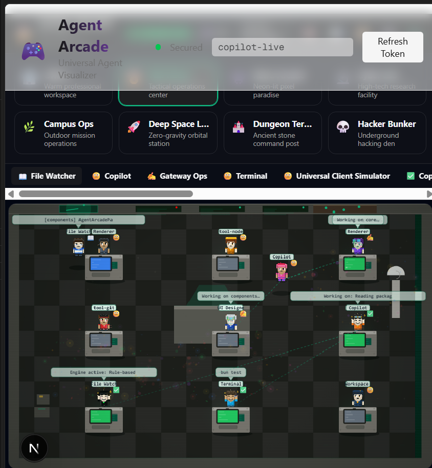
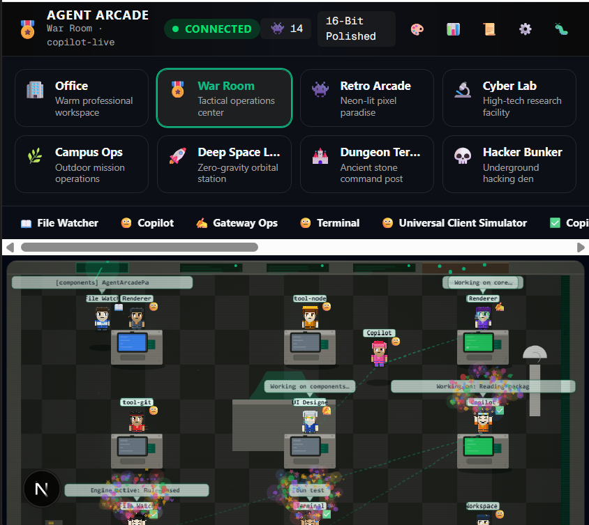
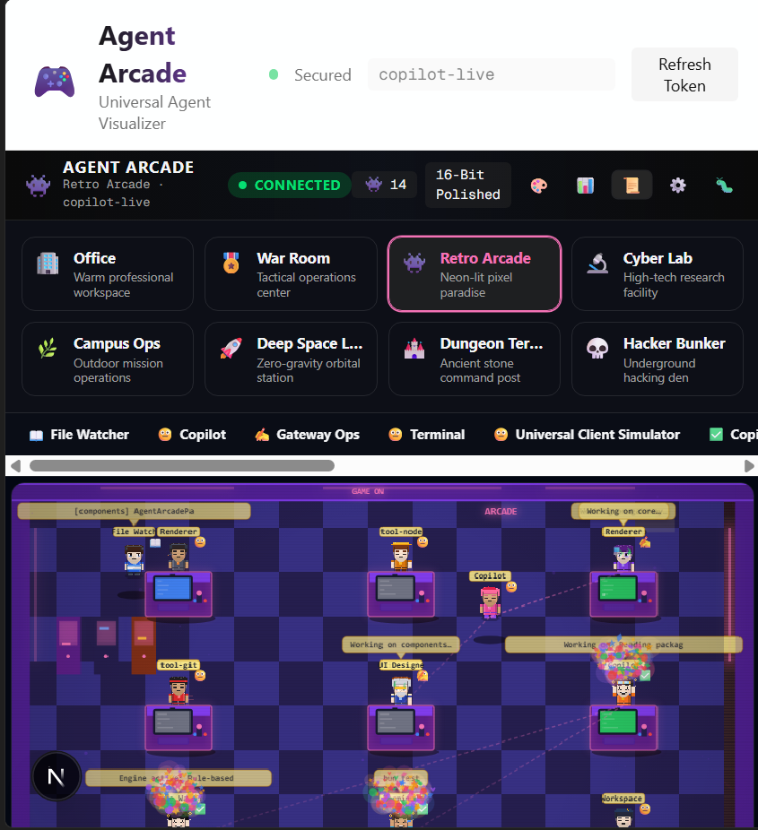
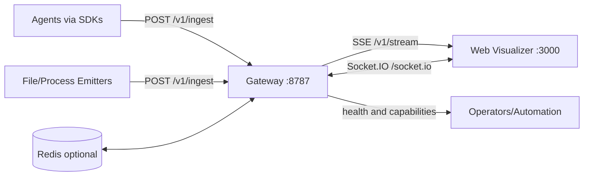

<div align="center">


# Agent Arcade

### Real-time AI Agent Telemetry Gateway & Visualizer

[](https://github.com/inbharatai/agent-arcade-gateway)
[](LICENSE)
[](https://github.com/inbharatai/agent-arcade-gateway/releases)

**Watch your AI agents work in real-time with pixel-art flair**

<br />


*14 agents collaborating in the Retro Arcade theme with live timeline tracking*

</div>

---

<div align="center">

[](https://github.com/inbharatai/agent-arcade-gateway/issues)
[](https://github.com/inbharatai/agent-arcade-gateway/pulls)
[](https://github.com/inbharatai/agent-arcade-gateway/actions)
[](https://github.com/inbharatai/agent-arcade-gateway/blob/main/SECURITY.md)
[](https://github.com/inbharatai/agent-arcade-gateway/blob/main/CONTRIBUTING.md)

</div>

---

## 🖼️ Screenshots

<table>
<tr>
<td width="50%">

### 🎯 Timeline View
Real-time activity timeline showing agent states, tool usage, and event counts per agent.



</td>
<td width="50%">

### 🔍 Agent Details
Deep-dive into individual agent metrics: trust score, uptime, current action, and message history.



</td>
</tr>
<tr>
<td colspan="2">

### 🌈 8 Beautiful Themes
Choose from Office, War Room, **Retro Arcade**, Cyber Lab, Campus Ops, Deep Space, Dungeon, or Hacker Bunker.



</td>
</tr>
</table>

---

## ✨ What is Agent Arcade?

Agent Arcade turns raw agent events into a **real-time operational view**: who is active, what tools are being used, where work is blocked, and how sessions progress over time.

> **Most agent systems expose logs. Agent Arcade exposes behavior.**

### Key Features

- 🎬 **Live Visualization** — Session-scoped real-time agent activity
- 🔌 **Multi-Transport** — HTTP, WebSocket, SSE ingestion
- ⏪ **Replay Support** — Timeline reconstruction for debugging
- 🔐 **Security Controls** — JWT auth, signing, CORS, rate limits
- 📦 **Multi-SDK** — Node.js, Browser, Python clients
- 🐳 **Production-Ready** — Docker Compose or PM2 deployment

## 📦 What You Get

| Component | Description | Port |
|-----------|-------------|------|
| **Gateway** | Telemetry ingestion server | `8787` |
| **Web Visualizer** | Next.js real-time dashboard | `3000` |
| **SDK - Node.js** | `packages/sdk-node` | — |
| **SDK - Browser** | `packages/sdk-browser` | — |
| **SDK - Python** | `packages/sdk-python` | — |
| **Load Scripts** | `scripts/load/*` | — |
| **Deployment** | Docker Compose, PM2, nginx/caddy | — |

---

## 🏗️ Architecture



---

## 🎯 Feature Highlights

### Real-time State Model

Track agents through visual states:

| State | Description |
|-------|-------------|
| 🟡 `idle` | Waiting for work |
| 🤔 `thinking` | Processing / reasoning |
| 📖 `reading` | Reading files / context |
| ✍️ `writing` | Writing code / content |
| 🔧 `tool` | Executing a tool |
| ⏳ `waiting` | Waiting for external input |
| ✅ `done` | Task completed |

### Session Telemetry

- Per-session stream and replay
- Agent-level progress and labels
- Message and tool events
- Parent-child links between agents
- Position events for layout and scene rendering

### Operational Safeguards

- 🔐 JWT-based auth in secure mode
- ✍️ Session signatures for trusted client session access
- 🌐 CORS allowlist controls
- 🚦 Flood and payload-size controls
- 💚 Health and readiness endpoints

---

## 🚀 Quick Start

### Prerequisites

| Requirement | Version |
|-------------|---------|
| Node.js | 20+ |
| npm | 10+ |
| Bun | 1.3+ |

### 1️⃣ Install Dependencies

```bash
npm ci
cd packages/gateway && bun install
cd ../web && npm ci
```

### 2️⃣ Start Services

```bash
# Terminal 1 - Gateway
npm run dev:gateway

# Terminal 2 - Web Dashboard
npm run dev:web
```

**Or run everything in one command:**

```bash
npm run dev:arcade
```

### 3️⃣ Open Dashboard

| Endpoint | URL |
|----------|-----|
| **Web Dashboard** | http://localhost:3000 |
| **Gateway Health** | http://localhost:8787/health |
| **Capabilities** | http://localhost:8787/v1/capabilities |

### 4️⃣ Generate Test Activity

```bash
node scripts/load/human-like-sim.mjs
```

---

## 📖 Usage Guide

Agent Arcade is a **telemetry layer**. It observes your AI workflow by receiving events from your code — it doesn't replace your app logic.

### How It Works

```
┌─────────────────┐    ┌──────────────┐    ┌─────────────────┐
│  Your AI App    │───▶│   Gateway    │───▶│  Web Dashboard  │
│  (emits events) │    │   :8787      │    │     :3000       │
└─────────────────┘    └──────────────┘    └─────────────────┘
```

### Event Types

| Event | When to Emit |
|-------|--------------|
| `agent.spawn` | AI worker/assistant starts |
| `agent.state` | Status changes (thinking, reading, writing, tool, waiting, done) |
| `agent.tool` | Tool called (read_file, run_command, grep_search, etc.) |
| `agent.message` | User-facing status updates |
| `agent.end` | Task completed or failed |

### Session Strategy

Use a separate `sessionId` per scope for clean filtering:

| Scope | Example sessionId |
|-------|-------------------|
| App | `client-app-prod` |
| Environment | `staging-run` |
| Job/Request | `ticket-1234` |

### Example Workflow (Cursor + External Codebase)

1. Start Arcade: `npm run dev:arcade`
2. Add Node/Python/browser emitter to your project
3. Wrap key AI steps with telemetry calls
4. Code normally in Cursor
5. Watch real-time activity at http://localhost:3000

### Zero-Wiring Mode

Auto-detect workspace without manual reconnection:

```bash
# Pin target workspace (one-time)
npm run emitter:auto -- "C:/path/to/client-project"

# Auto-reuse last pinned workspace
npm run emitter:auto
```

Or start everything with one command:

```bash
npm run dev:arcade -- "C:/path/to/client-project"
```

Config stored in `.arcade-emitter.json`.

### Auto-Heal Mode

Watchdog that auto-restarts crashed services:

```bash
npm run dev:watchdog
```

| Env Variable | Default |
|--------------|---------|
| `ARCADE_WATCHDOG_INTERVAL_MS` | `10000` |
| `ARCADE_WATCHDOG_COOLDOWN_MS` | `30000` |
| `ARCADE_GATEWAY_HEALTH_URL` | `http://localhost:8787/health` |
| `ARCADE_WEB_HEALTH_URL` | `http://localhost:3000/api/health` |

> ⚠️ **Note:** Agent Arcade only shows what is emitted. If your app doesn't send events, the dashboard cannot infer hidden AI actions.

---

## 💻 SDK Examples

### Node.js

```typescript
import { AgentArcade } from '@agent-arcade/sdk-node'

const arcade = new AgentArcade({
  url: 'http://localhost:8787',
  sessionId: 'node-demo-session',
})

const agentId = arcade.spawn({ name: 'Node Coder', role: 'assistant' })
arcade.state(agentId, 'thinking', { label: 'Planning implementation', progress: 0.2 })
arcade.tool(agentId, 'read_file', { path: 'src/index.ts', label: 'Reading source' })
arcade.state(agentId, 'writing', { label: 'Writing feature', progress: 0.7 })
arcade.message(agentId, 'Implementation complete, running checks')
arcade.end(agentId, { reason: 'Task complete', success: true })
arcade.disconnect()
```

### Browser (ES Module)

```typescript
import { AgentArcadeBrowser } from '@agent-arcade/sdk-browser'

const arcade = AgentArcadeBrowser.init({
  url: 'http://localhost:8787',
  sessionId: 'browser-demo-session',
})

const agentId = arcade.spawn({ name: 'Frontend Agent', role: 'assistant' })
arcade.state(agentId, 'thinking', { label: 'Preparing UI update', progress: 0.3 })
arcade.tool(agentId, 'open_browser', { label: 'Previewing page' })
arcade.state(agentId, 'writing', { label: 'Updating components', progress: 0.85 })
arcade.end(agentId, { reason: 'UI changes applied', success: true })
```

### Browser (Script Tag)

```html
<script src="https://unpkg.com/@agent-arcade/sdk-browser/dist/index.js"></script>
<script>
  const arcade = window.AgentArcade.init({
    url: 'http://localhost:8787',
    sessionId: 'browser-global-demo',
  })

  const id = arcade.spawn({ name: 'Browser Bot' })
  arcade.state(id, 'thinking', { label: 'Analyzing page' })
  arcade.end(id, { reason: 'Done' })
</script>
```

### Python

```python
from agent_arcade import AgentArcade

arcade = AgentArcade(url="http://localhost:8787", session_id="python-demo-session")

agent_id = arcade.spawn(name="Python Planner", role="assistant")
arcade.state(agent_id, "thinking", label="Reviewing requirements", progress=0.25)
arcade.tool(agent_id, "read_file", path="docs/spec.md", label="Reading spec")
arcade.state(agent_id, "writing", label="Drafting solution", progress=0.8)
arcade.message(agent_id, "Submitting final plan")
arcade.end(agent_id, reason="Completed", success=True)
arcade.disconnect()
```

---

## 📡 Protocol Reference

### Ingest Payload Example

```json
{
  "sessionId": "copilot-live",
  "agentId": "copilot-main",
  "type": "agent.state",
  "ts": 1773120000000,
  "payload": {
    "state": "writing",
    "label": "Drafting response",
    "progress": 0.62,
    "source": "process",
    "confidence": 0.96
  }
}
```

### Supported Events

| Event | Description |
|-------|-------------|
| `agent.spawn` | New agent created |
| `agent.state` | State transition |
| `agent.tool` | Tool invocation |
| `agent.message` | Status message |
| `agent.link` | Parent-child relationship |
| `agent.position` | Layout position |
| `agent.end` | Agent completed |
| `session.start` | Session begins |
| `session.end` | Session ends |

---

## 🔌 API Endpoints

### Gateway (`:8787`)

| Method | Endpoint | Description |
|--------|----------|-------------|
| POST | `/v1/ingest` | Ingest telemetry events |
| GET | `/v1/stream?sessionId=...` | SSE event stream |
| GET | `/v1/connect?sessionId=...` | WebSocket connect |
| GET | `/v1/capabilities` | Server capabilities |
| GET | `/health` | Health check |
| GET | `/ready` | Readiness probe |

### Web (`:3000`)

| Method | Endpoint | Description |
|--------|----------|-------------|
| GET | `/api/health` | Dashboard health |
| POST | `/api/session-token` | Generate session token |

---

## ✅ Quality Gates

```bash
npm run ci
```

Runs: lint → typecheck → build → test

---

## 🐳 Production Deployment

### Docker Compose

```bash
docker compose up -d --build
```

**Required Secrets:**

| Variable | Purpose |
|----------|---------|
| `JWT_SECRET` | Auth token signing |
| `SESSION_SIGNING_SECRET` | Session validation |
| `GATEWAY_JWT_SECRET` | Gateway auth (must match web) |

### PM2 (VM/Bare Metal)

```bash
npm run build:web
npm run prod:start
npm run prod:status
```

---

## 🔐 Security

| Recommendation | Setting |
|----------------|---------|
| Enable auth | `REQUIRE_AUTH=1` |
| Strong secrets | 32+ bytes random |
| CORS restriction | Set `ALLOWED_ORIGINS` |
| HTTPS | Configure at edge proxy |
| Branch protection | Enabled on `main` |

📄 See also: [SECURITY.md](SECURITY.md) • [Deployment Runbook](docs/DEPLOYMENT_RUNBOOK.md) • [Prod Readiness](docs/PROD_READINESS_GAPS.md)

---

## 🗂️ Monorepo Map

```
agent-arcade-gateway/
├── packages/
│   ├── gateway/        # Bun HTTP + Socket.IO + SSE telemetry gateway
│   ├── web/            # Next.js visualizer and UI runtime
│   ├── sdk-node/       # Node.js client SDK
│   ├── sdk-browser/    # Browser client SDK
│   └── sdk-python/     # Python SDK
├── scripts/load/       # Load generation and simulation tools
├── docs/               # Runbooks, readiness notes, integration guides
└── docker-compose.yml  # Production deployment
```

---

## 🤝 Contributing

Contributions are welcome!

1. Fork the repository
2. Create a feature branch
3. Run `npm run ci`
4. Open a pull request

📄 See [CONTRIBUTING.md](CONTRIBUTING.md) for full guidelines.

---

## 📄 License

MIT License — see [LICENSE](LICENSE)

---

<div align="center">

**Built with ❤️ for AI agent observability**

[Report Bug](https://github.com/inbharatai/agent-arcade-gateway/issues) • [Request Feature](https://github.com/inbharatai/agent-arcade-gateway/issues) • [Discussions](https://github.com/inbharatai/agent-arcade-gateway/discussions)

</div>
