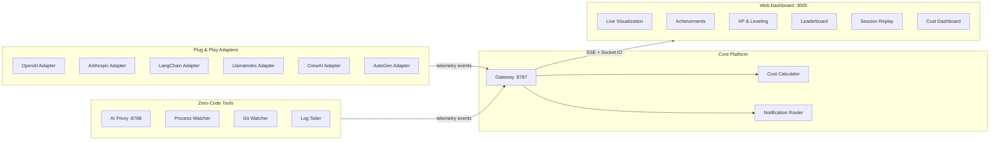

<div align="center">


# Agent Arcade

### Universal AI Agent Observability Platform

[](https://github.com/inbharatai/agent-arcade-gateway)
[](LICENSE)
[](https://github.com/inbharatai/agent-arcade-gateway/releases)
[](https://github.com/inbharatai)

**Watch any AI agent work in real-time. Plug & play with every framework.**

<br />


*Multi-agent session: OpenAI, Claude, LangChain, and CrewAI agents collaborating — live cost tracking, XP leveling, and achievement unlocks*

</div>

---

<div align="center">

[](https://github.com/inbharatai/agent-arcade-gateway/issues)
[](https://github.com/inbharatai/agent-arcade-gateway/pulls)
[](https://github.com/inbharatai/agent-arcade-gateway/actions)
[](SECURITY.md)
[](CONTRIBUTING.md)

</div>

---

## Why Agent Arcade?

Most AI observability tools give you logs after the fact. Agent Arcade gives you a **live command center** — see every agent, every tool call, every token spent, **as it happens**.

> **One platform. Every AI framework. Zero code changes.**

```
                    ┌─── OpenAI ───┐
                    ├── Anthropic ──┤
                    ├── OpenClaw ───┤
 Your AI Agents ────├── LangChain ──┼───▶ Agent Arcade ───▶ Live Dashboard
                    ├── CrewAI ─────┤       Gateway           + Achievements
                    ├── AutoGen ────┤       + Proxy           + XP System
                    ├── LlamaIndex ─┤       + Watchers        + Cost Tracking
                    └── Any HTTP AI ┘                         + Replay
```

---

## What's New in v3.0

<table>
<tr>
<td>

### Plug & Play Adapters
7 framework adapters — wrap any AI SDK in one line

### Zero-Code Proxy
Change your base URL, get full telemetry. No SDK needed.

### Gamification Engine
32 achievements, 12 XP levels, streaks, leaderboards

</td>
<td>

### Cost Intelligence
Real-time spend tracking for 25+ models with budget alerts

### Session Replay
Record, playback, seek, and share debugging sessions

### Multi-Channel Alerts
Slack, Discord, Email, WhatsApp notifications

</td>
</tr>
</table>

---

## Supported Frameworks

| Framework | Package | Integration | Language |
|-----------|---------|-------------|----------|
| **OpenAI** | `@agent-arcade/adapter-openai` | `wrapOpenAI(client)` — one line | TypeScript |
| **Anthropic/Claude** | `@agent-arcade/adapter-anthropic` | `wrapAnthropic(client)` — one line | TypeScript |
| **OpenClaw** | `@agent-arcade/adapter-openclaw` | `wrapOpenClaw(claw)` — one line | TypeScript |
| **LangChain** | `@agent-arcade/adapter-langchain` | Callback handler | TypeScript |
| **LlamaIndex** | `@agent-arcade/adapter-llamaindex` | Callback handler | TypeScript |
| **CrewAI** | `agent-arcade-crewai` | `arcade_crew(crew)` decorator | Python |
| **AutoGen** | `agent-arcade-autogen` | `wrap_autogen_agents(agents)` | Python |
| **Any AI API** | `@agent-arcade/proxy` | Just change your base URL | Any |
| **Claude Code** | `@agent-arcade/cli` | `agent-arcade hook claude-code` | Shell |
| **Aider / Cursor** | `@agent-arcade/watcher` | Auto-detected from processes | Any |

---

## Quick Start

### Prerequisites

| Requirement | Version |
|-------------|---------|
| [Bun](https://bun.sh) | 1.3+ |
| [Node.js](https://nodejs.org) | 20+ |

### Option A: CLI (Recommended)

```bash
# Install and start everything
npx @agent-arcade/cli init
npx @agent-arcade/cli start

# Run an interactive demo with 4 simulated agents
npx @agent-arcade/cli demo
```

### Option B: Manual Setup

```bash
# Clone and install
git clone https://github.com/inbharatai/agent-arcade-gateway.git
cd agent-arcade-gateway
npm ci
cd packages/gateway && bun install && cd ../..
cd packages/web && npm ci && cd ../..

# Start services (two terminals)
npm run dev:gateway    # Gateway on :8787
npm run dev:web        # Dashboard on :3000
```

### Option C: One Command

```bash
npm run dev:arcade
```

### Open the Dashboard

| Endpoint | URL |
|----------|-----|
| **Dashboard** | http://localhost:3000 |
| **Gateway Health** | http://localhost:8787/health |
| **Gateway Capabilities** | http://localhost:8787/v1/capabilities |
| **AI Proxy** | http://localhost:8788 |

---

## Integration Examples

### OpenAI — One Line

```typescript
import OpenAI from 'openai'
import { wrapOpenAI } from '@agent-arcade/adapter-openai'

const client = wrapOpenAI(new OpenAI(), {
  gatewayUrl: 'http://localhost:8787',
  sessionId: 'my-app',
})

// Use OpenAI exactly as before — telemetry is automatic
const response = await client.chat.completions.create({
  model: 'gpt-4o',
  messages: [{ role: 'user', content: 'Hello!' }],
})
```

### Anthropic/Claude — One Line

```typescript
import Anthropic from '@anthropic-ai/sdk'
import { wrapAnthropic } from '@agent-arcade/adapter-anthropic'

const client = wrapAnthropic(new Anthropic(), {
  gatewayUrl: 'http://localhost:8787',
  sessionId: 'my-app',
})

// All calls — streaming, tool use, extended thinking — tracked automatically
const message = await client.messages.create({
  model: 'claude-sonnet-4-20250514',
  max_tokens: 1024,
  messages: [{ role: 'user', content: 'Explain quantum computing' }],
})
```

### OpenClaw — One Line

```typescript
import { wrapOpenClaw } from '@agent-arcade/adapter-openclaw'

const claw = wrapOpenClaw(openClawInstance, {
  gatewayUrl: 'http://localhost:8787',
  sessionId: 'my-claw',
})

// OpenClaw runs normally — Brain, Skills, Memory, Heartbeat all visualized
// Every ReAct loop step, skill execution, and memory operation appears live
```

Or use event hooks for granular control:

```typescript
import { createOpenClawHooks } from '@agent-arcade/adapter-openclaw'

const hooks = createOpenClawHooks({
  gatewayUrl: 'http://localhost:8787',
  sessionId: 'my-claw',
})

claw.on('brain:think', hooks.onThink)
claw.on('brain:act', hooks.onAct)
claw.on('skill:start', hooks.onSkillStart)
claw.on('skill:end', hooks.onSkillEnd)
```

### Zero-Code Proxy — Any Language

```bash
# Start the proxy
bun run packages/proxy/src/index.ts

# Python — just change the base URL
OPENAI_BASE_URL=http://localhost:8788/openai python my_app.py

# Node.js
ANTHROPIC_BASE_URL=http://localhost:8788/anthropic node my_app.js

# Ollama
OLLAMA_HOST=http://localhost:8788/ollama ollama run llama3
```

Supported proxy targets: **OpenAI, Anthropic, Google Gemini, Ollama, Mistral**

### LangChain

```typescript
import { createArcadeCallback } from '@agent-arcade/adapter-langchain'

const callback = createArcadeCallback({
  gatewayUrl: 'http://localhost:8787',
  sessionId: 'langchain-app',
})

// Pass as callback to any LangChain chain, agent, or tool
const result = await chain.invoke({ input: "..." }, { callbacks: [callback] })
```

### CrewAI (Python)

```python
from crewai import Crew, Agent, Task
from agent_arcade_crewai import arcade_crew

crew = Crew(agents=[...], tasks=[...])
crew = arcade_crew(crew, gateway_url="http://localhost:8787", session_id="crewai-app")
crew.kickoff()  # All agent/task lifecycle events tracked automatically
```

### AutoGen (Python)

```python
from autogen import AssistantAgent, UserProxyAgent
from agent_arcade_autogen import wrap_autogen_agents

assistant = AssistantAgent("coder", llm_config={...})
user_proxy = UserProxyAgent("user", code_execution_config={...})

wrap_autogen_agents([assistant, user_proxy],
    gateway_url="http://localhost:8787",
    session_id="autogen-app"
)
user_proxy.initiate_chat(assistant, message="Write a web scraper")
```

### Node.js SDK (Manual)

```typescript
import { AgentArcade } from '@agent-arcade/sdk-node'

const arcade = new AgentArcade({ url: 'http://localhost:8787', sessionId: 'my-session' })

const agentId = arcade.spawn({ name: 'My Agent', role: 'coder' })
arcade.state(agentId, 'thinking', { label: 'Planning...' })
arcade.tool(agentId, 'read_file', { path: 'src/index.ts' })
arcade.state(agentId, 'writing', { label: 'Implementing feature' })
arcade.end(agentId, { reason: 'Task complete', success: true })
arcade.disconnect()
```

### Python SDK (Manual)

```python
from agent_arcade import AgentArcade

arcade = AgentArcade(url="http://localhost:8787", session_id="my-session")

agent_id = arcade.spawn(name="My Agent", role="coder")
arcade.state(agent_id, "thinking", label="Planning...")
arcade.tool(agent_id, "read_file", path="src/main.py")
arcade.state(agent_id, "writing", label="Implementing feature")
arcade.end(agent_id, reason="Task complete", success=True)
arcade.disconnect()
```

---

## Architecture



---

## Gamification System

### Achievements (32 Unlockable)

| Category | Examples | Tiers |
|----------|----------|-------|
| **Speed** | Lightning Reflexes, Speed Demon, Time Lord | Bronze → Diamond |
| **Reliability** | Error Free, Rock Solid, Perfectionist | Bronze → Diamond |
| **Tooling** | Tool User, Swiss Army, Tool Master | Bronze → Diamond |
| **Endurance** | Marathon Runner, Iron Will, Unstoppable | Bronze → Diamond |
| **Teamwork** | Team Player, Hivemind, Swarm Intelligence | Bronze → Diamond |
| **Special** | First Blood, Night Owl, Early Bird, Century | Bronze → Diamond |

### XP & Leveling

12 RPG-style levels with streak multipliers:

| Level | Title | XP Required | Color |
|-------|-------|-------------|-------|
| 1 | Novice | 0 | Gray |
| 2 | Apprentice | 500 | Green |
| 3 | Journeyman | 1,500 | Blue |
| 4 | Adept | 3,500 | Purple |
| 5 | Expert | 7,000 | Amber |
| 6 | Master | 12,000 | Red |
| 7 | Grandmaster | 20,000 | Pink |
| 8 | Champion | 32,000 | Orange |
| 9 | Legend | 50,000 | Teal |
| 10 | Mythic | 80,000 | Gold |
| 11 | Transcendent | 120,000 | Diamond |
| 12 | Godlike | 200,000 | Magenta |

**XP Sources:** Task completion (100), speed bonuses (50-200), error-free runs (25), tool diversity (10/tool), error recovery (50), achievement unlocks (200-2500)

**Streak Multiplier:** +0.1x per consecutive day, up to 3.0x

### Leaderboard

Sortable rankings across 5 categories: Overall, Speed, Reliability, Tooling, Endurance. Top 3 agents get medal icons.

---

## Cost Intelligence

Real-time cost tracking for 25+ AI models:

| Provider | Models Tracked |
|----------|---------------|
| **Anthropic** | Claude Opus 4, Sonnet 4, Haiku 3.5 |
| **OpenAI** | GPT-4o, GPT-4o-mini, o1, o1-mini, GPT-4 Turbo |
| **Google** | Gemini 1.5 Pro, Gemini 1.5 Flash, Gemini 2.0 |
| **Mistral** | Mistral Large, Mistral Medium, Mistral Small |
| **DeepSeek** | DeepSeek V3, DeepSeek R1 |
| **Local** | Ollama, llama.cpp (free) |

Features:
- Per-agent and per-session cost breakdown
- Model-colored cost bars in the dashboard
- Budget threshold alerts (warning at 80%, critical at 95%)
- Fuzzy model name matching (handles versioned names like `gpt-4o-2024-08-06`)
- Export cost reports as JSON

---

## Session Replay

Record and replay agent sessions for debugging and sharing:

- **Record** — Captures all events with relative timestamps
- **Playback** — Speed control: 0.25x, 0.5x, 1x, 2x, 4x, 8x
- **Seek** — Scrub to any point in the timeline
- **Pause/Resume** — Stop and continue playback
- **Save** — Persist up to 50 recordings in localStorage
- **Import/Export** — Share sessions as JSON files

---

## Notifications

Multi-channel alert system:

| Channel | Transport | Setup |
|---------|-----------|-------|
| **Slack** | Webhook | Paste incoming webhook URL |
| **Discord** | Webhook | Paste channel webhook URL |
| **Email** | SMTP (nodemailer) | Configure SMTP credentials |
| **WhatsApp** | API (planned) | Coming soon |

### Alert Types

- **Cost threshold** — Alert when spend exceeds budget percentage
- **Error rate** — Alert when agent error rate spikes
- **Agent errors** — Immediate notification on agent failure
- **Agent waiting** — Alert when agent is blocked too long
- **Session complete** — Summary notification when session ends

Rate limiting prevents notification spam (configurable cooldown per channel).

---

## Zero-Code Instrumentation

### AI Proxy

Intercepts AI API calls without touching your code:

```bash
# Start proxy
bun run packages/proxy/src/index.ts

# Route any AI SDK through it
OPENAI_BASE_URL=http://localhost:8788/openai python app.py
ANTHROPIC_BASE_URL=http://localhost:8788/anthropic node app.js
OLLAMA_HOST=http://localhost:8788/ollama ollama run llama3
```

Tracks: model name, token usage, latency, streaming vs non-streaming, errors.

### Process Watcher

Auto-detects running AI agents by scanning system processes:

| Detected Process | Agent Type |
|-----------------|------------|
| `claude` | Claude Code |
| `aider` | Aider |
| `cursor` | Cursor |
| `devin` | Devin |
| `copilot` | GitHub Copilot |
| `ollama` | Ollama |
| `langchain` | LangChain |
| `crewai` | CrewAI |
| `autogen` | AutoGen |
| `llamaindex` | LlamaIndex |

Infers agent state from CPU usage: >50% = thinking, >20% = writing, >5% = reading.

### Git Watcher

Monitors your git index and emits file change events every 5 seconds. Automatically detects new, modified, and deleted files.

### Log Tailer

Watches AI tool log files with parsers for Claude Code, Aider, and generic formats. Auto-detects tool calls, thinking states, errors, and writing events.

### Claude Code Hooks

```bash
agent-arcade hook claude-code
```

Generates `pre-tool.sh` and `post-tool.sh` scripts that emit telemetry for every tool invocation in Claude Code.

---

## CLI

```bash
# Initialize — scans for AI tools and generates config
agent-arcade init

# Start all services (gateway + web + optional proxy)
agent-arcade start

# Check status
agent-arcade status

# Run a 4-agent simulation demo
agent-arcade demo

# Install Claude Code hooks
agent-arcade hook claude-code
```

### Config File

Create `arcade.config.json` in your project root:

```json
{
  "gateway": { "port": 8787 },
  "web": { "port": 3000 },
  "proxy": { "enabled": true, "port": 8788 },
  "agents": [
    { "name": "Claude Code", "type": "claude-code", "auto": true },
    { "name": "GPT Assistant", "type": "openai", "model": "gpt-4o" }
  ],
  "alerts": {
    "slack": { "webhook": "https://hooks.slack.com/..." },
    "costThreshold": 10.00
  }
}
```

---

## Protocol Reference

### Event Types

| Event | Description | When to Emit |
|-------|-------------|--------------|
| `agent.spawn` | New agent created | AI worker starts |
| `agent.state` | State transition | Status changes |
| `agent.tool` | Tool invocation | Tool called |
| `agent.message` | Status message | User-facing updates |
| `agent.link` | Parent-child link | Agent creates sub-agent |
| `agent.position` | Layout position | For scene rendering |
| `agent.end` | Agent completed | Task done or failed |
| `session.start` | Session begins | App starts |
| `session.end` | Session ends | App shuts down |

### Agent States

| State | Icon | Description |
|-------|------|-------------|
| `idle` | `idle` | Waiting for work |
| `thinking` | `thinking` | Processing / reasoning |
| `reading` | `reading` | Reading files / context |
| `writing` | `writing` | Writing code / content |
| `tool` | `tool` | Executing a tool |
| `waiting` | `waiting` | Waiting for external input |
| `moving` | `moving` | Navigating / transitioning |
| `error` | `error` | Error occurred |
| `done` | `done` | Task completed |

### Ingest Payload

```json
{
  "v": 1,
  "sessionId": "my-session",
  "agentId": "agent-001",
  "type": "agent.state",
  "ts": 1773120000000,
  "payload": {
    "state": "writing",
    "label": "Implementing feature",
    "progress": 0.62
  }
}
```

---

## API Endpoints

### Gateway (`:8787`)

| Method | Endpoint | Description |
|--------|----------|-------------|
| POST | `/v1/ingest` | Ingest telemetry events |
| GET | `/v1/stream?sessionId=...` | SSE event stream |
| GET | `/v1/connect?sessionId=...` | WebSocket (Socket.IO) |
| GET | `/v1/capabilities` | Server capabilities |
| GET | `/health` | Health check |
| GET | `/ready` | Readiness probe |

### AI Proxy (`:8788`)

| Path | Target |
|------|--------|
| `/openai/*` | api.openai.com |
| `/anthropic/*` | api.anthropic.com |
| `/gemini/*` | generativelanguage.googleapis.com |
| `/ollama/*` | localhost:11434 |
| `/mistral/*` | api.mistral.ai |

---

## Monorepo Map

```
agent-arcade-gateway/
├── packages/
│   ├── gateway/             # Bun telemetry gateway (HTTP + Socket.IO + SSE)
│   ├── web/                 # Next.js dashboard with gamification UI
│   ├── proxy/               # Zero-code AI API proxy
│   ├── cli/                 # CLI tool (init, start, demo, hooks)
│   ├── core/                # Shared types and utilities
│   ├── embed/               # Embeddable widget
│   │
│   ├── adapter-openai/      # OpenAI SDK wrapper
│   ├── adapter-anthropic/   # Anthropic/Claude SDK wrapper
│   ├── adapter-openclaw/    # OpenClaw agent framework wrapper
│   ├── adapter-langchain/   # LangChain callback handler
│   ├── adapter-llamaindex/  # LlamaIndex callback handler
│   ├── adapter-crewai/      # CrewAI Python adapter
│   ├── adapter-autogen/     # AutoGen Python adapter
│   │
│   ├── sdk-node/            # Node.js client SDK
│   ├── sdk-browser/         # Browser client SDK
│   ├── sdk-python/          # Python client SDK
│   │
│   ├── watcher/             # AI process auto-detector
│   ├── git-watcher/         # Git index change watcher
│   ├── log-tailer/          # AI log file parser
│   └── notifications/       # Multi-channel alert router
│
├── scripts/                 # Load testing, simulation, dev tools
├── docs/                    # Runbooks, architecture, guides
├── docker-compose.yml       # Production deployment
└── arcade.config.example.json  # Config template
```

---

## Production Deployment

### Docker Compose

```bash
docker compose up -d --build
```

### PM2 (VM/Bare Metal)

```bash
npm run build:web
npm run prod:start    # Start with PM2
npm run prod:status   # Check status
npm run prod:logs     # View logs
```

### Environment Variables

| Variable | Default | Purpose |
|----------|---------|---------|
| `PROXY_PORT` | `8788` | AI Proxy port |
| `GATEWAY_URL` | `http://localhost:8787` | Gateway URL for proxy |
| `SESSION_ID` | Auto-generated | Default session |
| `JWT_SECRET` | — | Auth token signing |
| `SESSION_SIGNING_SECRET` | — | Session validation |
| `REQUIRE_AUTH` | `0` | Enable JWT auth |
| `ALLOWED_ORIGINS` | `*` | CORS allowlist |

---

## Security

| Feature | Details |
|---------|---------|
| JWT auth | Optional, enable with `REQUIRE_AUTH=1` |
| Session signing | Required in production |
| CORS | Configurable allowlist with ReDoS protection |
| Input validation | Names ≤200, roles ≤100, labels ≤500, messages ≤4000 chars |
| Rate limiting | Flood and payload-size controls |
| HTTPS | Configure at reverse proxy |

See [SECURITY.md](SECURITY.md) for the full security policy.

---

## Testing

```bash
# Run all tests
npm run ci           # lint → typecheck → build → test

# Individual suites
npm run test:gateway  # 25 gateway tests
npm run test:store    # Store tests
npm run test:sdk      # SDK tests
npm run lint:web      # ESLint
npm run typecheck:web # TypeScript check
```

---

## Contributing

Contributions are welcome!

1. Fork the repository
2. Create a feature branch
3. Run `npm run ci` to verify
4. Open a pull request

See [CONTRIBUTING.md](CONTRIBUTING.md) for full guidelines.

---

## License

MIT License — see [LICENSE](LICENSE)

---

<div align="center">

**Built with intensity by [InBharat AI](https://github.com/inbharatai)**

**Agent Arcade v3.0 — See every AI agent. Track every token. Level up.**

[Report Bug](https://github.com/inbharatai/agent-arcade-gateway/issues) | [Request Feature](https://github.com/inbharatai/agent-arcade-gateway/issues) | [Discussions](https://github.com/inbharatai/agent-arcade-gateway/discussions)

</div>
