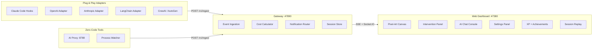

<div align="center">


# Agent Arcade

### Universal AI Agent Observability Platform

[](https://github.com/inbharatai/agent-arcade-gateway)
[](LICENSE)
[](https://github.com/inbharatai/agent-arcade-gateway/releases)
[](https://github.com/inbharatai)

**Watch any AI agent work in real-time. Plug & play with every framework.**

<br />


*Live session: 20+ agents — Claude Code, OpenAI, Gemini, Mistral — collaborating with real-time XP leveling, cost tracking, and intervention controls*

</div>

---

## What Is Agent Arcade?

Agent Arcade is a **universal AI agent cockpit** — a live command center that lets you watch, debug, and control any AI agent, from any framework, in real-time. Think of it as the game dashboard your AI agents didn't know they needed.

> **One platform. Every AI framework. Zero code changes required.**

```
                    ┌── Claude Code ──┐
                    ├── OpenAI ────────┤
                    ├── Anthropic ─────┤
 Your AI Agents ────├── LangChain ─────┼───▶  Agent Arcade  ───▶  Live Dashboard
                    ├── CrewAI ─────────┤      Gateway               + XP Leveling
                    ├── Cursor / Aider ─┤      :47890                + Cost Tracking
                    ├── Ollama / Mistral┤                            + Achievements
                    └── Any HTTP API ──┘                            + Intervention
```

**Gateway-first API key design:** set your API key **once** in the gateway `.env` — every connected client auto-uses it. No per-client configuration needed.

---

## Live Dashboard

<div align="center">


*20+ concurrent agents visualized as pixel-art characters — each with live speech bubbles, tool states, XP bars, and cost tracking*

</div>

### What You See on the Canvas

- **Pixel-art agents** — each AI worker rendered as a unique character based on their model (Claude → purple, GPT-4 → green, Gemini → blue, Mistral → teal)
- **Live speech bubbles** — real-time task labels (e.g. "Designing microservices layout...", "Running Jest tests...", "Deploying to production...")
- **State indicators** — thinking 🤔, writing ✍️, tool use 🔧, done ✅, error ❌
- **Progress bars** — per-agent task completion
- **XP & cost** — session totals in the status bar (1385 XP · 15 🏆 · $0.17)
- **CONNECTED badge** — live WebSocket/SSE status to the gateway

---

## AI Chat Console

<div align="center">


*Built-in AI chat panel — ask questions about your running agents, get explanations, direct the session — powered by Claude Sonnet 4.5 (gateway-first, no API key needed in browser)*

</div>

### Console Features

- **Claude Sonnet 4.5** pre-selected — switch to GPT-4o, Gemini, Mistral from the dropdown
- **Token + cost counter** — live token count and `~$0.000039` cost estimate per message
- **Export conversation** — save the full chat as markdown
- **Gateway-first keys** — set `ANTHROPIC_API_KEY` once in `packages/gateway/.env`, the console auto-connects. No key prompts in the browser.
- **Ctrl+Enter to send** — keyboard-driven workflow
- **Templates (Ctrl+K)** — quick command presets

---

## Agent Intervention System

<div align="center">


*Click any agent → get full intervention controls: Pause/Stop, redirect with a new task, or hand off to another agent*

</div>

### What You Can Do

| Control | Action |
|---------|--------|
| **⏸ Pause** | Freeze the agent mid-task, inspect state |
| **⏹ Stop** | Terminate the agent immediately |
| **Redirect** | Send a new direction (free-text or quick preset) |
| **Hand Off** | Reassign the task to a different agent |
| **Presets** | One-click common redirections ("Use JWT instead of sessions", "Add TypeScript strict mode", "Skip tests for now", "Use PostgreSQL not MySQL") |

### REST API Control

```bash
# Pause any agent
curl -X POST http://localhost:47890/v1/agents/agent-001/pause

# Redirect with new instruction
curl -X POST http://localhost:47890/v1/agents/agent-001/redirect \
  -H "Content-Type: application/json" \
  -d '{"instruction": "Focus on the authentication module first"}'

# Stop completely
curl -X POST http://localhost:47890/v1/agents/agent-001/stop
```

---

## Settings Panel

The ⚙️ Settings panel (5 tabs) is accessible from the toolbar:

| Tab | What It Controls |
|-----|-----------------|
| **Console** | Default AI model, token count display, cost estimates, history retention |
| **Providers** | Enter Anthropic / OpenAI / Gemini / Mistral API keys — stored AES-256 encrypted |
| **Language** | 20-language detection for console input (Hindi, Hinglish, Arabic, CJK, and more) |
| **Appearance** | Console font size, code font (Mono / Fira Code / JetBrains Mono), animation speed, compact mode |
| **About** | Version info, gateway connection status |

---

## Quick Start

### Prerequisites

| Requirement | Version |
|-------------|---------|
| [Bun](https://bun.sh) | 1.3+ |
| [Node.js](https://nodejs.org) | 20+ |

### 1. Clone & Install

```bash
git clone https://github.com/inbharatai/agent-arcade-gateway.git
cd agent-arcade-gateway
npm ci
cd packages/gateway && bun install && cd ../..
```

### 2. Configure API Key (once — all clients share it)

```bash
# packages/gateway/.env
ANTHROPIC_API_KEY=sk-ant-...
# OPENAI_API_KEY=sk-...
# GEMINI_API_KEY=...
# MISTRAL_API_KEY=...
```

### 3. Start Everything

```bash
# Option A: one command
npm run dev:arcade

# Option B: two terminals
npm run dev:gateway    # Gateway on :47890
npm run dev:web        # Dashboard on :47380
```

### 4. Open the Dashboard

```
http://localhost:47380
```

### 5. Hook into Claude Code (optional — you're using it RIGHT NOW)

```bash
npx @agent-arcade/cli hook claude-code
```

This registers hooks in `~/.claude/settings.json` — every tool call Claude Code makes (Bash, Edit, Read, Write, etc.) appears live in your Arcade dashboard. No code changes. Just run one command.

---

## Framework Integrations

### Claude Code Hooks — Zero Configuration

```bash
# Install hooks — registers PreToolUse/PostToolUse/Notification/Stop in ~/.claude/settings.json
agent-arcade hook claude-code
```

From that point, every Claude Code tool invocation shows up in the dashboard:
- **PreToolUse** → spawns agent card + emits `agent.tool` event
- **PostToolUse** → updates state (thinking if success, error if failure)
- **Notification** → emits `agent.message` for user-facing updates
- **Stop** → emits `agent.end` with task summary

### OpenAI — One Line

```typescript
import OpenAI from 'openai'
import { wrapOpenAI } from '@agent-arcade/adapter-openai'

const client = wrapOpenAI(new OpenAI(), {
  gatewayUrl: 'http://localhost:47890',
  sessionId: 'my-app',
})

// Use exactly as before — streaming, tool use, and function calling all tracked
const response = await client.chat.completions.create({
  model: 'gpt-4o',
  messages: [{ role: 'user', content: 'Hello!' }],
  stream: true,
})
```

### Anthropic/Claude — One Line

```typescript
import Anthropic from '@anthropic-ai/sdk'
import { wrapAnthropic } from '@agent-arcade/adapter-anthropic'

const client = wrapAnthropic(new Anthropic(), {
  gatewayUrl: 'http://localhost:47890',
  sessionId: 'my-app',
})

// Streaming, tool use blocks, extended thinking — all tracked automatically
const message = await client.messages.create({
  model: 'claude-sonnet-4-5',
  max_tokens: 1024,
  messages: [{ role: 'user', content: 'Explain quantum computing' }],
})
```

### Zero-Code Proxy — Any Language, No SDK Changes

```bash
# Start the proxy
bun run packages/proxy/src/index.ts

# Python — just change the base URL
OPENAI_BASE_URL=http://localhost:8788/openai python my_app.py

# Node.js
ANTHROPIC_BASE_URL=http://localhost:8788/anthropic node my_app.js

# Ollama
OLLAMA_HOST=http://localhost:8788/ollama ollama run llama3
```

Supported proxy targets: **OpenAI, Anthropic, Google Gemini, Ollama, Mistral**

### LangChain

```typescript
import { createArcadeCallback } from '@agent-arcade/adapter-langchain'

const callback = createArcadeCallback({
  gatewayUrl: 'http://localhost:47890',
  sessionId: 'langchain-app',
})

const result = await chain.invoke({ input: "..." }, { callbacks: [callback] })
```

### CrewAI (Python)

```python
from crewai import Crew, Agent, Task
from agent_arcade_crewai import arcade_crew

crew = Crew(agents=[...], tasks=[...])
crew = arcade_crew(crew, gateway_url="http://localhost:47890", session_id="crewai-app")
crew.kickoff()
```

### AutoGen (Python)

```python
from autogen import AssistantAgent, UserProxyAgent
from agent_arcade_autogen import wrap_autogen_agents

assistant = AssistantAgent("coder", llm_config={...})
user_proxy = UserProxyAgent("user", code_execution_config={...})

wrap_autogen_agents([assistant, user_proxy],
    gateway_url="http://localhost:47890",
    session_id="autogen-app"
)
user_proxy.initiate_chat(assistant, message="Write a web scraper")
```

### Node.js SDK (Manual)

```typescript
import { AgentArcade } from '@agent-arcade/sdk-node'

const arcade = new AgentArcade({ url: 'http://localhost:47890', sessionId: 'my-session' })

const agentId = arcade.spawn({ name: 'My Agent', role: 'coder' })
arcade.state(agentId, 'thinking', { label: 'Planning...' })
arcade.tool(agentId, 'read_file', { path: 'src/index.ts' })
arcade.state(agentId, 'writing', { label: 'Implementing feature' })
arcade.end(agentId, { reason: 'Task complete', success: true })
arcade.disconnect()
```

### Embed Widget

```tsx
import { AgentArcadeEmbed } from '@agent-arcade/embed'

<AgentArcadeEmbed
  gatewayUrl="http://localhost:47890"
  sessionId="my-session"
  width="100%"
  height={600}
  theme="office"
  darkMode={true}
/>
```

---

## All Supported Frameworks

| Framework | Package | Method |
|-----------|---------|--------|
| **Claude Code** | `@agent-arcade/cli` | `agent-arcade hook claude-code` — hooks `~/.claude/settings.json` |
| **OpenAI** | `@agent-arcade/adapter-openai` | `wrapOpenAI(client)` |
| **Anthropic** | `@agent-arcade/adapter-anthropic` | `wrapAnthropic(client)` |
| **LangChain** | `@agent-arcade/adapter-langchain` | Callback handler |
| **LlamaIndex** | `@agent-arcade/adapter-llamaindex` | Callback handler |
| **CrewAI** | `agent-arcade-crewai` | `arcade_crew(crew)` |
| **AutoGen** | `agent-arcade-autogen` | `wrap_autogen_agents(agents)` |
| **Any AI API** | `@agent-arcade/proxy` | Change base URL only |
| **Cursor / Aider** | `@agent-arcade/watcher` | Process auto-detection |
| **Ollama** | `@agent-arcade/watcher` | Process auto-detection |

---

## Gamification System

### 32 Achievements

| Category | Examples |
|----------|---------|
| **Speed** | Lightning Reflexes, Speed Demon, Time Lord |
| **Reliability** | Error Free, Rock Solid, Perfectionist |
| **Tooling** | Tool User, Swiss Army, Tool Master |
| **Endurance** | Marathon Runner, Iron Will, Unstoppable |
| **Teamwork** | Team Player, Hivemind, Swarm Intelligence |
| **Special** | First Blood, Night Owl, Early Bird, Century |

### 12 XP Levels

| Level | Title | XP |
|-------|-------|----|
| 1 | Novice | 0 |
| 2 | Apprentice | 500 |
| 3 | Journeyman | 1,500 |
| 4 | Adept | 3,500 |
| 5 | Expert | 7,000 |
| 6–12 | Master → Godlike | 12K → 200K |

**Streak multiplier:** +0.1x per consecutive day, up to 3.0x

---

## Cost Intelligence

Real-time cost tracking for 25+ AI models:

| Provider | Models |
|----------|--------|
| **Anthropic** | Claude Opus 4, Sonnet 4.5, Haiku 3.5 |
| **OpenAI** | GPT-4o, GPT-4o-mini, o1, o3-mini |
| **Google** | Gemini 2.0 Flash, 1.5 Pro |
| **Mistral** | Mistral Large, Medium, Small |
| **Local** | Ollama (free) |

Budget alerts at 80% and 95% of configured threshold. Export cost reports as JSON.

---

## Architecture



---

## API Reference

### Gateway (`:47890`)

| Method | Endpoint | Description |
|--------|----------|-------------|
| POST | `/v1/ingest` | Ingest telemetry events |
| GET | `/v1/stream?sessionId=` | SSE event stream |
| GET | `/v1/state?sessionId=` | Session snapshot (for SSE refresh) |
| GET | `/v1/capabilities` | Server capabilities |
| GET | `/health` | Health check |
| POST | `/v1/agents/:id/pause` | Pause agent |
| POST | `/v1/agents/:id/resume` | Resume agent |
| POST | `/v1/agents/:id/stop` | Stop agent |
| POST | `/v1/agents/:id/redirect` | Redirect agent `{ instruction }` |
| GET | `/v1/chat/providers` | List available AI providers |
| POST | `/v1/chat` | Proxy AI chat request |

### Event Protocol

```json
{
  "v": 1,
  "sessionId": "my-session",
  "agentId": "agent-001",
  "type": "agent.state",
  "ts": 1773120000000,
  "payload": {
    "state": "writing",
    "label": "Implementing auth middleware",
    "progress": 0.62
  }
}
```

### Agent States

| State | Description |
|-------|-------------|
| `thinking` | Processing / reasoning |
| `writing` | Writing code or content |
| `reading` | Reading files or context |
| `tool` | Executing a tool |
| `idle` | Waiting for work |
| `error` | Error occurred |
| `done` | Task completed |

---

## Monorepo Map

```
agent-arcade-gateway/
├── packages/
│   ├── gateway/             # Bun telemetry gateway (HTTP + Socket.IO + SSE)
│   ├── web/                 # Next.js dashboard (canvas, console, settings, intervention)
│   ├── proxy/               # Zero-code AI API proxy (Bun)
│   ├── cli/                 # CLI tool (init, start, demo, hook claude-code)
│   ├── embed/               # React embed widget + URL builder
│   │
│   ├── adapter-openai/      # OpenAI SDK wrapper
│   ├── adapter-anthropic/   # Anthropic SDK wrapper (streaming + tool use)
│   ├── adapter-langchain/   # LangChain callback handler
│   ├── adapter-llamaindex/  # LlamaIndex callback handler
│   ├── adapter-crewai/      # CrewAI Python adapter
│   ├── adapter-autogen/     # AutoGen Python adapter
│   │
│   ├── sdk-node/            # Node.js client SDK
│   ├── sdk-browser/         # Browser client SDK
│   ├── sdk-python/          # Python client SDK
│   │
│   ├── watcher/             # AI process auto-detector (Claude, Cursor, Aider, Ollama)
│   ├── git-watcher/         # Git index change watcher
│   ├── log-tailer/          # AI log file parser
│   └── notifications/       # Slack / Discord / Email / WhatsApp alerts
│
├── docs/screenshots/        # Real screenshots from live sessions
├── scripts/                 # Load testing, simulation, dev tools
└── docker-compose.yml       # Production deployment
```

---

## Testing

```bash
# Full CI pipeline
npm run ci           # lint → typecheck → build → test (152 tests)

# Individual suites
npm run test:gateway  # 25 gateway tests
npm run test:sdk      # SDK tests
npm run lint:web      # ESLint
npm run typecheck:web # TypeScript
```

---

## Production Deployment

```bash
# Docker Compose
docker compose up -d --build

# PM2 (VM / bare metal)
npm run build:web
npm run prod:start
```

### Environment Variables

| Variable | Default | Purpose |
|----------|---------|---------|
| `ANTHROPIC_API_KEY` | — | Claude API key (shared by all clients) |
| `OPENAI_API_KEY` | — | OpenAI API key |
| `GEMINI_API_KEY` | — | Google Gemini key |
| `MISTRAL_API_KEY` | — | Mistral API key |
| `PORT` | `47890` | Gateway port |
| `REQUIRE_AUTH` | `0` | Enable JWT auth |
| `JWT_SECRET` | — | Auth token signing |
| `ALLOWED_ORIGINS` | `*` | CORS allowlist |

---

## Security

| Feature | Details |
|---------|---------|
| JWT auth | Optional — `REQUIRE_AUTH=1` |
| AES-256 encryption | API keys encrypted in localStorage |
| CORS | Configurable allowlist |
| Input validation | Names ≤200, labels ≤500, messages ≤4000 chars |
| Rate limiting | Flood and payload-size protection |

---

## Contributing

1. Fork the repository
2. Create a feature branch
3. Run `npm run ci` to verify all 152 tests pass
4. Open a pull request

See [CONTRIBUTING.md](CONTRIBUTING.md) for full guidelines.

---

<div align="center">

**Built with intensity by [InBharat AI](https://github.com/inbharatai)**

**Agent Arcade v3.2 — See every AI agent. Track every token. Level up.**

*Claude Code · OpenAI · Anthropic · LangChain · CrewAI · AutoGen · LlamaIndex · Mistral · Ollama*

[Report Bug](https://github.com/inbharatai/agent-arcade-gateway/issues) · [Request Feature](https://github.com/inbharatai/agent-arcade-gateway/issues) · [Discussions](https://github.com/inbharatai/agent-arcade-gateway/discussions)

</div>
